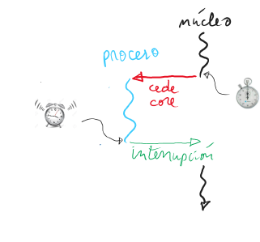
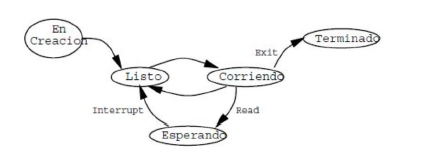
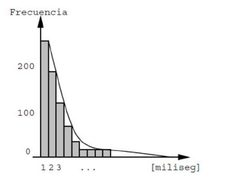

# Administracion de procesos

## El nucleo del sistema operativo

* Brinda los servicion basicos para que los procesos se puedan ejecutar, como por ejemplo las llamadas a sistema (`open()`, `read()`, `fork()`, `pipe()`, etc.)
* Siempre residente en memoria.
* Se ejecuta en modo privilegiado: tiene acceso a toda la maquina, sin restricciones.
* Asigna de manera eficiente los recursos de hardware a los procesos.

## Un proceso

* Es un procesador virtual en donde se ejecuta una aplicacion (Chrome, Gimp, LibreOffice) o herramienta del sistema operativo (`ls`, `cp`, `zip`).
* Se ejecuta en un modo protegido: no tiene acceso directo a la maquina, pero está protegido de las acciones de otros procesos.

# Principio de Virtualizacion

* Para asignar eficientemente un recurso limitado, el sistema operativo ,o transforma en multiples recursos virtuales identicos, otorgables a diferentes usuarios.
* Ejemplo 1: El hardware ofrece solo `p` cores, entonces el sistema permite crear multiples cores virtuales denomidados **threads** (o procesos livianos) que comparten la misma memoria.
* Ejemplo 2: El hardware ofrece una sola memoria, entonces el sistema permite crear multiples procesadores virtuales con su propia memoria, denomidados **procesos Unix o procesos pesados**.
* Ejemplo 3: El hardware ofrece una sola pantalla, entonces el sistema grafico permite crear multiples pantallas virtuales denominadas ventanas.
* Ejemplo 4: El hardware ofrece unos pocos discos de tamaño fijo, entonces el sistema permite crear multiples discos virtuales de tamaño variable denomidados archivos.
* Otros ejemplos: la red, la impresora, el cronometro.

# Clasificacion de procesos: livianos vs. pesados

Segun si comparte o no la memoria: **threads** si la comparten, **procesos Unix** si no la comparten.

* Los primeros procesadores no tenian la **Memory Management Unit** necesaria para implementar procesos pesados y por lo tanto ofrecian solo threads, por ejemplo el commodore Amiga 1000 (1985).
  * Si las aplicaciones corren en threads, pueden interferir entre ellas y por lo tanto no hay proteccion.
  * Si una aplicacion se caia en el Amiga habia que dar reset.

* **Los procesos pesados otorgan proteccion pero son mas costosos en cpu y uso de memoria.**

# Clasificion de procesos: preemptiveness

Segun si el nucleo puede quitarles el core que ocupan o no: a un **proceso preemptive** si se le puede quitar, no a un proceso **non preemptive** (sin adelantamiento).

* Una vez que el nucleo le cede un core a un proceso non preemptive, solo el mismo proceso se lo puede devolver al nucleo.
* Los primeros sistemas que fueron capaces de cargar simultaneamente multiples aplicaciones solo permitian procesos non preemptive poruqe si se les quitaba el core dejaban de funcionar establemente.
* La aplicacion debia devolver rapidamente el core para tener un buen **tiempo de respuesta**.
* Si una aplicacion se quedaba en un ciclo infinito, habia que dar reset.

## Ejemplos de sistemas preemptive y non preemptive

* Windows 3.11 y los primeros Mac Os solo ofrecian procesos livianos non preemptive.
* En Unix/Linux/Android/Windows/OS X todos los procesos son preemptive y pueden ser pesados o livianos.

# Scheduling de procesos

* En este capitulo vamos a estudiar la virtualizacion de los cores, es decir la implementacion de los threads.
* La atribucion estrategica de los cores a los distintos threads en ejecucion se denomina **scheduling de procesos**.
* De ello se encarga el **scheduler de procesos** en el nucleo.
* Se busca maximizar alguna propiedad particular como por ejemplo el tiempo de despacho o el tiempo de respuesta.

# Interrupciones y timer

* Para poder implementar procesos preemptive, el procesador debe admitir **interrupciones** e incluir un **cronometro regresivo (timer)** por cada core.
* Antes de ceder un core a un proceso, el scheduler configura el timer para gatillar una interrupcion despues de unas pocas centesimas de segundo.
* La interrupcion le devuelve el core al nucleo.
* Las interrupciones son como las señales de PSS, pero se envian a los drivers en el nucleo, no a un proceso.
* Las señales son interrupciones virtuales.
* Mas tarde, el nucleo decide cuando darle nuevamente un core al proceso.
* El proceso no se da cuenta que se quedo sin core por un momento.



# Estados de un proceso

* Mientras se ejecutan los procesos, transitan por diversos estados.



* **En creacion:** Nucleo trabajando para obtener recursos del proceso.
* **RUN:** El proceso se ejecuta en algun core.
* **WAIT:** El proceso espera algun evento, como la lectura de un sector del disco.
* **READY:** No se le ha asignado ningun core al proceso pero es elegible para uno.
* **ZOMBIE:** El proceso terminó pero espera ser enterrado.

# El descriptor de proceso

* **Es una estructura de datos en donde el nucleo mantiene informacion asociada a un proceso:**
  * Su estado.
  * Registros del procesador cuando no tiene un core asignado. Cada core tiene su propio juego unico de registros, por tanto puede ser ocupado por un solo thread.
  * Informacion de scheduling: prioridad, siguiente proceso en la cola de espera, etc.
  * Asignacion de recursos: memoria asignada, archivos abiertos, espacio de swapping, etc.
  * Contabilizacion de uso de recursos: tiempo de CPU.
* **Colas de scheduling:** En donde aguardan los descriptores de proceso a la espera de recursos.
* **Identificado de proceso (pid):** Identificador publico de un proceso, tipicamente un entero entre 0 y 99999.
* **Cambio de contexto:** Cuando el scheduler traspasa un core de un proceso a otro.
  * Es costoso, especialmente entre procesos pesados.
  * **Existen cambios de contexto implicitos y no implicitos**.
  * Implicitos: El proceso no cedió voluntariamente el core, el nucleo se lo quito, el scheduler los puede evitar.
  * No implicitos: El proceso cedió voluntariamente el core.
  * **No confundir los cambios de contexto con las interrupciones.**

# Ejemplo: nThreads

* Es un sistema operativo con fines pedagogicos.
* Se ejecuta en un proceso de Linux con un numero fijo de pthreads.
* Los pthreads se virtualizan en un sin numero de nano threads.
* Instructivo agregar nuevos schedulers o nuevas herramientas de sincronizacion.
* La misma API de los pthreads.
* El descriptor de un nano thread es:

  ```c
  typedef struct nthread *nThread;

  struct nthread {
    State status;  // RUN, READY, ZOMBIE, etc.
    char *thread_name;  // Useful for debugging purposes

    void *queue;  // The queue where this thread is waiting
    nThread nextTh;  // Next node in a linked list of threads
    nThread nextTimeTh; // Next node in a time ordered linked
    void **sp;  // Thread stack pointer when suspended
    void **stack;  // Pointer to the whole stack area

  // For nThreadExit and nThreadJoin
  void *retPtr;
  nThread joinTh;

  int wakeTime;  // For time queues
  };
  ```

  # Rafagas de CPU

  * **Secuencia de instrucciones de un proceso sin pasar por estados de espera.**
  * Un proceso se ejecuta en muchas rafagas.
  * **Proceso intensivo en CPU:** Sus rafagas duran mucho tiempo.
  * **Proceso intensivo en E/S (Entrada/Salida):** Sus rafagas son cortas.
  * El scheduler puede ejecutar las rafagas largas en varias tajadas de tiempo para darle la oportunidad a otros procesos de ejecutarse.


* Histograma de duracion:

  * Muchas rafagas cortas.
  * Muy pocas de larga duracion.
  
  