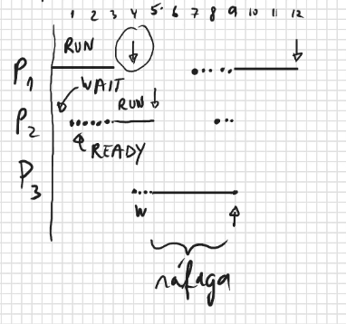
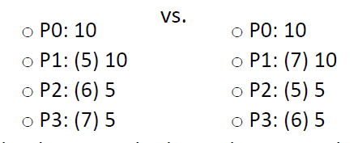
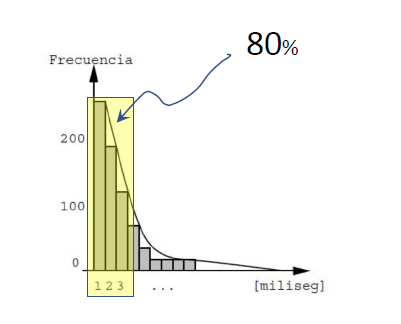

# Cambios de contexto
* **Cambio de contexto explicito: Cuando el cambio de contexto ocurre producto de una accion del mismo proceso, y no producto de una interrupcion del timer o del disco.**
* **Cambio de contexto implicito: Cuando el cambio de contexto ocurre producto de una interrupcion del timer o del disco.**

# Estrategias de Scheduling
* Se busca privilegiar alguna variable estadistica: el uso de CPU, tiempo de despacho o tiempo de respuesta.
* Al principio: maximizar el uso de la CPU (porque era costosa), y tambien busca simplicidad, igualdad.
* Estrategia: **FCFS** o **First Come First Served**.
* Se atienden las rafagas de los procesos por orden de llegada.
* Esta estrategia es non preemptive.

Ejercicio: Las siguientes son las rafagas de CPU de los procesos P1, P2 y P3. Entre parentesis se coloca la duracion del estado de espera.
  * P1: 3 (4) 3 (3) 2
  * P2: (1) 2 (3) 4 (4) 2
  * P3: (4) 4 (2) 4
* Graficar el uso de CPU para FCFS en un monoprocesador:

# Los problemas de FCFS
* No sirve para sistemas interactivos.
* **Mal tiempo de despacho promedio.**
* **Tiempo de despacho:** Es el tiempo que transcurre desde que llaga una rafaga (instante en que el proceso pasa de estado de espera READY o RUN) hasta que termina de atenderse (instante en que el proceso pasa nuevamente a estado de espera).

Ejercicio: Graficar
* En el primer ejemplo el tiempo de despacho promedio es 19, mientras que en el segundo es 15.6
  

* **Se puede demostrar que atendiendo primero las rafagas mas cortas se minimiza el tiempo de despacho promedio.**
* Ademas, FCFS tiende a atender primero los procesos intensivos en CPU, ocupando el 100% de CPU, pero dejando para el final los procesos intensivos en E/S, desperdiciando CPU.
* Mejor seria mezclar la atencion de ambos tipos de procesos.

# SJF: Shortest Job First

* Se atiende primero la rafaga mas corta, es decir, se cede la CPU a aquel proceso cuya proxima rafaga será la más corta entre todos los procesos READY.
* Como conocer cual sera la mas corta?
* Considerando que ya se han ejecutado $n$ rafagasm se estima la duracion de la rafaga $n+1$ del proceso $P$ con esta formula:

  $\tau_{n+1}^{P} = \alpha t_{n}^{p} + (1-\alpha)\tau_{n}^{P}$

  Donde:
  * $\tau_{n+1}^{P}$ es el predictor de la proxima rafaga.
  * $t_{n}^{p}$ es la duracion efectiva de la proxima rafaga.
  * $\tau_{n}^{P}$ es el predictor de la rafaga $n$ de $P$
  * $\alpha$ es el ponderador para la ultima rafaga
* Tipicamente $\alpha=5$
* La formula es equivalente a:
  
  $\tau_{n+1}^{P} = \alpha t_{n}^{p} + (1-\alpha)\tau_{n-1}^{P} + (1-\alpha)^2\tau_{n-2}^{P} + (1-\alpha)^3\tau_{n-3}^{P} + ...$

* La primera formula es mas rapida de calcular.

# Variantes de SJF

* Por simplicidad puede ser non preemptive.
* Pero tambien puede ser preemptive:
  * Si la duracion de la rafaga supera el siguiente mejor predictor, se le quita la CPU.
  * Si aparece una rafaga con mejor predictor, se le quita la CPU.
  * Etc.
* Desventaja: hambruna para los procesos intensivos en CPU.

# Prioridades

* A cada proceso se asigna una prioridad, segun su importancia.
* Se cede la CPU al proceso que tiene la mejor prioridad.
* Las prioridades pueden ser **estaticas**, es decir, que no cambian en el tiempo, o **dinamicas**.
* SJF es un ejemplo de prioridades dinamicas con:

    $Prio = \tau^{P}_{n+1}$
* Desventaja: hambruna.
* Variante: **Aging** (añejamiento).
  * Se evita la hambruna aumentando cada cierto tiempo la prioridad de todos los procesos READY (bonus).
  * Cuando un proceso recibe la CPU recupera su prioridad original.
  * Con suficiente tiempo de permanencia en la cola, tarde o temprano un proceso ganará la prioridad suficiente para recibir la CPU.

# Round Robin

* Se inventó para los sistemas de tiempo compartido: utilizados por multiples usuarios interactivos simultaneos.
* Preemptive por definicion.
* Los procesos se turnan para recibir tajadas de tiempo de CPU de 10 a 100 milisegundos (slices).
* Tambien se llama **time-slicing**.
* Minimiza el tiempo de respuesta.
* Informalmente se entiende **tiempo de respuesta** como el tiempo que transcurre desde que el usuario realiza una interaccion con la aplicacion hasta que recibe la primera señal de avance de su respuesta.
* No considera la respuesta completa.
* Una mejor implementacion es que deberia ser el maximo tiempo transcurrido entre la entrega de cada resultado parcial.

# Roud Robin: principio de funcionamiento

* Si un sistema tiene 5 usuarios activos, es mejor que cada usuario reciba 1/5 de la CPU de manera predecible que reciba CPU aleatoriamente.
* Problema: podria no haber memoria suficiente para las 5 aplicaciones cargadas simultaneamente.
* Alternativa: computadores personales mas baratos, mas lentos que los computadores institucionales pero con tiempo de respuesta predecible (años 80).
  
Experimento: la salida de un comando consta de 10 lineas de informacion.
  * Un usuario no recibe ninguna respuesta hasta que a los 5 segundo aparecen las 10 lineas de una sola vez.
  * Otro usuario recibe una linea cada 1 segundo hasta completar el resultado completo a los 10 segundos.
    * En que situacion se sentiria mas conforme?
    * Nuestra sicologia prefiere la segunda.
  
# Round Robin: implementacion

* Los procesos READY se mantienen en una cola FIFO (ready queue).
* Cuando el proceso en ejecucion desocupa la CPU (pasa a estado WAIT), se extrae el proceso en primer puesto en la cola y se le cede la CPU.
* Que hacer con los procesos que pasan a estado READY?
  * Se agregan al final de la cola: desfavorece a procesos intensivos en E/S.
  * Se agregan al principio de la cola: hambruna para intensivos en CPU.
  * Se otorga la CPU y el proceso que estaba ejecutandose se agreag al principio de la cola: hambruna.
  * Identico, pero su tajada se reduce al tiempo que le restaba en el momento de pasar a estado de espera: sin hambruna pero con mayor cantidad de cambios de contexto implicitos.

# Tamaño de la tajada

* Mientras mas grande (la tajada), peor es el tiempo de respuesta.
* Mientras mas pequeña, mejor tiempo de respuesta pero con mayor costo de cambios de contexto implicitos y mayor tiempo de despacho promedio.
* **Regla empirica: Fijar el tamaño de la tajada de modo que el 80% de las rafagas duren menos que la tajada y por lo tanto se ejecutan sin cambios de contexto implicito.**

