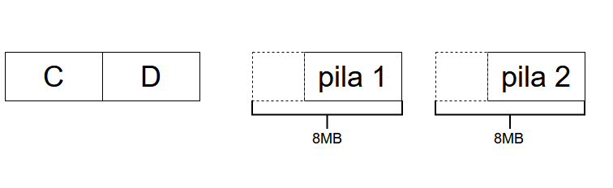
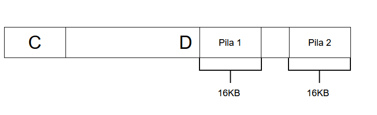
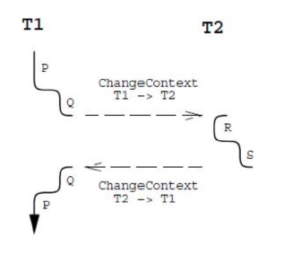

# Implementacion de threads: La pila

* Cada thread debe poseer su propia pila
* Ahi se apilan los registros de activacion de las funciones pendientes: **frames** (aca se guardan variables locales entre otros).
* Eficiente: al llamar a una funcion, para crear su frame basta restar el tamaño al puntero al puntero a la pila.
* Eficiente: al retornar, hay que sumar su tamaño al puntero a la pila.
* **Gracias al orden LIFO: la ultima funcion que se llamó será la primera en retornar, considerando un solo thread.**


# Threads: Nivel nucleo vs nivel usuario

* Que pasa con multiples threads: una pila por thread
* Problema: De que tamaño?

## Threads a nivel del nucleo: Ej. pthreads
---

* Las pilas se colocan en un area de memoria dinamicamente extensible hasta 8MB.
* **Desventaja**: el espacio de direccionamiento es limitado, por lo que se puede crear un numero limitado de pthreads.



* **C:** Codigo.
* **D:** Datos.

Las pilas crecen hacia la izquierda hasta un espacio de memoria de 8MB, luego se obtiene un error de Stack Overflow. Por otra parte, el sector de datos **D** crece hacia la derecha, en caso de que sector de datos y pilas coincidan, el nucleo simplemente asigna mas espacio entre ellos.

## Threads a nivel usuario: Ej. nThreads
---

* No las implementa el nucleo.
* Se implementan en base a funciones de biblioteca.
* Las pilas solo se pueden colocar en el heap.
* Si se crean de tamaño pequeño, se pueden crear muchos mas threads: tipicamente pilas de 16KB.
* **Pero las pilas se desbordan con facilidad (crencen hacia la izquierda).**
* La deteccion del desborde es un problema.
* Hay que modificar el compilador para que chequee el desborde.



# Alternativa que nadie implementa

* Modificar el compilador para que los frames se creen en el heap como cualquier estructura de datos.
* Se eliminan las pilas, en el heap se crean los registros de activacion para los threads.
* No se desperdicia espacio para prevenir desborde de pila.
* Ineficiente: puede llegar a ser 10x mas lento que multiples pilas.
* Porque un programa gasta 10x o mas en memoria para frames que en memoria para objetos en el heap.
* Las pilas son pequeñas porque los frames son de corta vida.
* **La mejor solucion hoy en dia: threads a nivel del nucleo, como pthreads.**
* **nThreads** tiene propositos pedagogicos: para mostrar como se administran los threads y procesos.
* Virtualizar $n$ pthreads para que ejecuten un numero indeterminado de nthreads es un problema similar a virtualizar $n$ cores fisicos para que ejecuten un numero indeterminado de pthreads (o procesos).

# Compatibilidad de nThreads con pthreads

* En la implementacion de nTreads, todas las funciones de la API tienen un nombre distinto al del estandar pthreads.
* `pthread_t` es `nThread`
* `pthread_create` es `nThreadsCreate`
* `pthread_mutex_lock` es `nLock`

Las funciones y variables globales que son parte de la implementacion empiezan con `nth_` y estas no deben ser utilizadas por el usuario.

* Pero las aplicaciones deben incluir:
  ```c
  #include "nthread.h" // no "pthread.h"
  ```

* En ese archivo se traducen con macros los nombres estandares a los nombres nThreads (es decir son alias):
  ```c
  #define pthread_t nThread
  #define pthread_create nThreadCreate
  #define pthread_mutex_lock nLock
  ```

* **Solo alguna funcones de C y Unix se pueden invocar: aquellas en las que aparece una definicion en `nthread.h`**

# El cambio de contexto

* Considerando que el numero de cores es limitado: un mismo core va ejecutando alternadamente distintos threads.
* El cambio de contexto es cuando un core pasa de ejecutar un thread a otro.
* **Restricciones:** El core tiene un solo juego de registros con un solo puntero a la pila (SP) y un solo puntero a la instruccion en ejecucion (o **contador de programa, PC**)
* En el cambio de contexto se resguardan los registros del thread saliente y se restauran los del thread entrante.



# El cambio de contexto en nThreads: `nKernel/nStack-amd64.s`

* Es la unica parte escrita en assembler.
* No se puede programar en C.
* El problema es similar a programar las funciones `setjmp`/`longjmp`, que tambien estan escritas en assembler.
* En nThreads: `_ChangeToStack(&spOut, &spIn);`
  * Funcion para resguardar los cambios de contexto.
  * `&spOut`: Puntero del stack saliente.
  * `&spIn`: Puntero del stack entrante.
  * Resguarda los registros en la pila del thread saliente con la pila apuntada por `spOut`.
  * Restaura los registros de la pila del thread entrante, con la pila apuntada por `spIn`.
* Tambien: `_CallInNewStack(&spOut, spNewm fun, ptr);`
  * Funcion para crear una pila al momento de lanzar un nuevo thread.
  * Se usa para llamar a la funcion raiz de un nuevo thread, con la pila apuntada por `spNew`.
  * Se restauran los registros en la pila del thread saliente, con la pila apuntada por `spOut`.

# Scheduler FCFS para single core: `nKernel/sched-fcfs-1core.c`

* La cola ready:
  * Cola para almacenar los descriptores de threads.
  ```c
  NthQueue *nth_fcfs1ReadyQueue;
  ```
* Pasar un thread a estado READY (para un solo core):
  ```c
  void nth_fcfs1SetReady(nThread th) {
    th->status = READY;  // Cambiamos el estado del thread
    nth_putBack(nth_fcfs1ReadyQueue, th); // Volvemos a poner el descripto en la cola
  }
  ```

* Pasar un thread a estado de espera:
  ```c
  void nth_fcfs1Suspend(State waitState) {
    nThread th = nSelf();
    th->status = waitState;
  }
  ```
* Escoge la siguiente funcion a ejecutar, toma el primer thread de la cola:
  ```c
  void nth_fcfs1Schedule(void) {
    nThread thisTh = nSelf(); // Determina su propio identificado, descriptor del thread
    if (thisTh!=NULL && (thisTh->status==READY || thisTh->status==RUN)) {
      thisTh->status = RUN;
      return;
    }

    nThread nextTh = nth_getFront(nth_fcfs1ReadyQueue);
    while (nextTh == NULL) {
      nth_corelsldle[0] = 1; // To prevent recursive calls
      sigsuspend(&nth_sigsetApp);
      nth_corelsldle[0] = 0;
      nextTh = nth_getFront(nth_fcfs1ReadyQueue);
    }

    nth_changeContext(thisTh, nextTh); // _changeToStack
    nth_setSelf(thisTh); // Set current running thread
    thisTh->status = RUN;
  }
  ```
  * En caso de que el thread se encuentre en estado READY pasa a estado RUN, en caso de estar ya ejecutandose, sigue ejecutandose.
  * En caso contrario, se obtiene de la cola de threads en estado READY, con la funcion `nth_getFront()`, el thread siguiente que debe continuar ejecutandose.

# Implementacion de semaforos: `nKernel/sem.c`

* Analogo a `sem_wait()` y `sem_post()`:
  
  ```c
  typedef struct {
    int count;
    void *queue; 
  } nSem;

  int nSemWait(nSem *pem) {
    START_CRITICAL
    if(psem->count->0)
      psem->count--;
    else {
      nThread thisTh = nSelf();
      nth_putBack(psem->queue, thisTh);
      suspend(WAIT_SEM);
      schedule();
    }
    END_CRITICAL
    return 0;
  }

  int nSemPost(nSem *psem) {
    START_CRITICAL
    if(nth_emptyQueue(psem->queue))
      psem->count++;
    else {
      nThread w = nth_getFront(psem->queue);
      setReady(w);
      schedule();
    }
    END_CRITICAL
    return 0;
  }
  ```
  * `START_CRITICAL`: Garantiza la **exclusion mutua**.  Creando esta seccion se inhiben las señales (interrupciones enc caso de sistema operativo) y por tanto el timer no le quitará la CPU al thread.
  * En la estructura `nSem` se encuentra un contador de fichas `count` y una cola `queue` con los thread en espera de una ficha.
  * `nSemWait()`: En caso de no existir fichas, ponemos en la cola al thread y lo suspendemos esperando una ficha. En caso contrario le restamos una ficha.
  * `nSemPost()`: En caso de estar vacia la cola de espera de threads por fichas, se deposita una ficha. En caso contrario, obtenemos el thread de la cola y cambiamos su estado a READY.

Tipicamente en las herramientas de sincronizacion se deben aplicar las siguientes funciones en este order:
  * `setReady(th);`
  * `suspend(WAIT...);`
  * `schedule();`
# Implementacion de secciones criticas: caso single core

**La unica fuente de dataraces son las señales/interrupciones**

* `START_CRITICAL` es una macro de C:
  * Inhibe las señales/interrupciones para que el timer no le quite la CPU.
  * `nth_sigsetCritical` include: `SIGALRM`, `SIGVTALRM`, `SIGIO`.
  * Es equivalente a:
  ```c
  sigset_t nth_sigsetOld;
  pthread_sigmask(SIG_BLOCK, &nth_sigsetCritical, nth_sigsetOld);
  ```
    * Bloquea las señales que se encuentran en `nth_sigsetCritical`.

* `END_CRITICAL` es una macro de C:
  * Permite nuevamente las señales/interrupciones.
  * Es equivalente a:
  ```c
  sigset_t nth_sigsetOld;
  pthread_sigmask(SIG_BLOCK, &nth_sigsetCritical, nth_sigsetOld);
  ```
  * Solo se aceptan las señales que se encuentran en `nth_sigsetCritical`.
  * En un nucleo real se inhiben las interrupciones con una instruccion de maquina como `disable` y se permiten nuevamente con la instruccion `enable`.
  * **Esta prohibido su uso a nivel de usuario.**