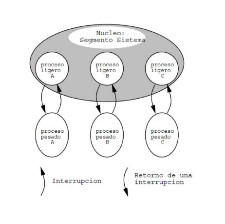
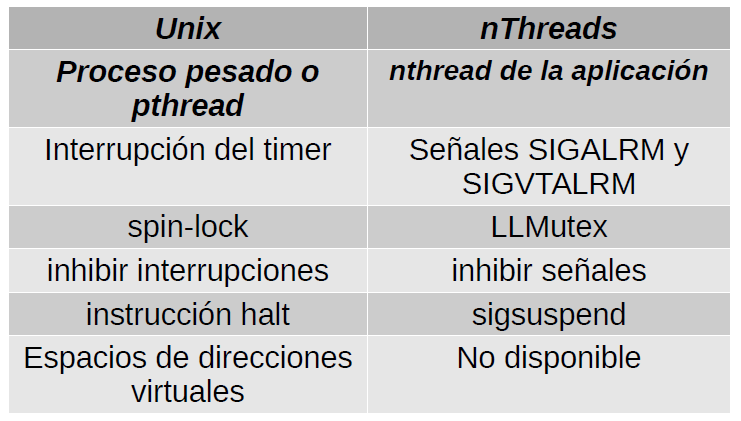

# Nucleo de Unix

Los procesadores tienen dos modos para trabajar:

* En **Modo Usuario**:
  * El nucleo es innaccesible. Segmento sistema inaccesible
  * Ciertas instrucciones privilegiadas estan deshabilitadas como la que inhibe las interrupciones.
  * **La unica forma de pasar a modo sistema es por medio de una interrupcion.**
  * Las llamadas a sistema (`open()`, `read()`, `fork()`, `exit()`) se implementan generando una interrupcion.
  * **El Stack Pointer es separado para modo usuario.**
* En **Modo Sistema**:
  * Se pueden ejecutar las instrucciones privilegiadas.
  * El codigo, datos y pila vive en el segmento sistema.
  * **Modo sistema tiene su propio Stack Pointer.**

# Espacio de direcciones virtuales


# Procesos Ligeros Peers

* Hay un proceso ligero por cada thread del usuario.
* Se denomina peer o contraparte.
* Atiende las interrupciones que ocurran mientras se ejecuta su contraparte en modo usuario.



# Relacion Unix y nThreads



* La exclusion mutua se garantizaba con un Low Level Mutex (LLMutex) para el caso de nThreads, a nivel de Unix se utiliza Spin-lock, es un semaforo binario, solo almacena un ticket como maximo (0 o 1).
* Cuando un core no encontraba un thread para ejecutar, se utilizaba `sigsuspend` para el caso de nThreads, a nivel de hardware, todos los procesos tienen una intruccion privilegiada llamada `halt`, lo cual detiene el reloj del core fisicamente.

**Todos los threads de los procesos pesados se convierten en un proceso ligero dentro del nucleo.**

* En una llamada a sistema (interrupcion).
* Una interrupcion de un dispositivo.

La implementacion de un nucleo de Unix es similar a la de nThreads.

# Unix en multiprocesadores

* Varios cores fisicos, cada uno con su propia memoria cache, pero compartiendo la memoria principal y los dispositivos. Solo si son threads, corriendo en un mismo proceso.
* Un proceso pesado es un computador virtual en el que multiples cores virtuales (los threads) comparten la memoria (el espacio de direcciones virtuales).
* Los pthreads aparecen aparecen recien en ~2005, con la aparicion de los primeros chips multicores para computadores personales.

# Scheduling

* Cada core posee su propio cronometro regresivo fisico.
* La cola de procesos ready es compartida por todos los cores.

* **Problema:** que sucede si dos cores extraen un proceso al mismo tiempo? (**Datarace**)
* **Para garantizar la exclusion mutua, inhibir las interrupciones no es suficiente.**

# Estrategias de Implementacion de Scheduling

*  **Nucleo clasico**: Se admite un solo core trabajando dentro del nucleo.
   *  Ventaja: Facil de implementar en un nucleo clasico.
   *  Desventaja: No hay paralelismo en el nucleo.
* **Nucleo Moderno de Unix**: Se garantiza la **exclusion mutua a nivel de cada estructura de datos compartida en el nucleo.**
  * Ventaja: Hay paralelismo en el nucleo.
  * Desventaja: Mucho mas complejo crear la exclusion mutua por estructura.
  * **Problema:** Como se implementa la exclusion mutua?
  * **Solucion: Spin Locks.** 
    * **Es un semaforo binario que se implementa con busy waiting.**

# Implementacion **Incorrecta** de spin-locks

```c
void spinLock(int *plock) {
  while (*plock == CLOSED) ; // INCORRECTA
  *plock = CLOSED;
}

void spinUnlock(int *plock) {
  *plock = OPEN;
}
```
* El compilador de C guarda la condicion del `while` en un registro que luego no se cambia, por lo tanto se convertirá en un ciclo infinito.
* Se necesita ayuda del hardware para poder implementar correctamente un spin-lock.
* Todos los procesadores poseen una instruccion `swap` que intercambia **automaticamente** el valor almacenado en un registro por el valor almacenado en una direccion de memoria.

# La instruccion `swap`

En assembler: `swap [R1], R2`

* `R1` contiene la direccion de entero en memoria.
* Ese entero puede contener `OPEN` o `CLOSED`.
* `R2` contiene el valor `CLOSED`.
* `swap` intercambia los valores almacenados en `R2` y el entero en memoria.
* Si el entero en memoria contenia `OPEN`, queda en `CLOSED` y `R2` queda en `OPEN`.
* Consideremos una funcion `swap` que hace lo mismo que esta otra funcion `swap` escrita en C:
 
  ```c
  int swap(int *psl, int val) {
    int ret = *psl;
    *psl = val;
    return ret;
  }
  ```
* Pero está escrita en assembler para usar la instruccion de maquina `swap` y por lo tanto es **atomica**. Los `swap` se ejecutan secuelcialmente, por tanto no es posible que otro thread venga al mismo instante y realice la operacion `swap`, tendrá que esperar a que termine la operacion `swap` que habia antes.

# Implementacion **ineficiente** de spin-locks

```c
void spinLock(int *plock) {
  while (swap(psl, CLOSED)==CLOSED) ; // INCORRECTA
  *plock = CLOSED;
}

void spinUnlock(int *plock) {
  *plock = OPEN;
}
```

* Esta implementacion es correcta, pero **ineficiente** porque puede producir exceso de trafico en el bus de datos que es compartido por todos los procesadores para comunicarse entre sí y para llegar a la memoria.
* No hay problema si se pide el spin-lock y esta libre.
* Tampoco hay problema si un solo procesador pide el spin-lock que está siendo ocupado por otro procesador
* El procesador en espera hará busy-waiting llamando a `swap` hasta que se invoque `spinUnlock`.
* El acceso a la memoria de `swap` ocurrirá en la memoria cache del procesador en espera, sin interferir con la ejecucion de otros procesadores.