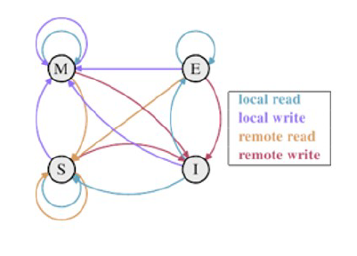

# Spin-Locks

Un spin-lock es un mutex que se implementa con **busy-waiting**. Esto se maneja a traves de un entero que puede ser `OPEN` o `CLOSED` (macro).
* Uso:

  ```c
  int sl = OPEN;

  spinLock(&sl);
  ..// sl es CLOSED
  spinUnlock(&sl);
  ```

* Es funcionalmente equivalente a un semaforo que puede almacenar maximo 1 ticket.

# Coherencia de la memoria cache

* Por razones de eficiencia, cada procesador tiene su propio cache.
* Supongamos que un procesador P1 ocupa el spin-lock y otro procesador P2 espera.
* P1 y P2 mantienen una copia en sus caches del spin-lock con valor `CLOSED`.
* Cuando P1 invoca `spinUnlock`, si se escribe `OPEN` solo en el cache de P1, pero no en P2, P2 podria quedar esperando indefinidamente.
* El problema ocurre porque hay una inconsistencia en los valores almacenados para el spin-lock en los caches de P1 y P2.
* **Todos los computadores multicore deben implementar un protocolo que garantice la coherencia de la memoria cache**: todos los valores deben ver el mismo valor.

# Protocolo MESI

* El protocolo de coherencia de memoria cache mas conocido se denomina **MESI**, por **M**odified, **E**xclusive, **S**hared e **I**nvalid.
* Como sabemos, la memoria cache se dividia en lineas, cada linea disponible en la memoria cache puede estar en uno de estos 4 estados:
  * **Modified:** El procesador local ha modificado la linea, tambien implica que es la unica copia dentro de los caches.
  * **Exclusive:** La linea no ha sido modificada pero se sabe que es la unica copia.
  * **Shared:** La linea no está modificada y podrá existir en otros caches.
  * **Invalid:** La linea está libre, no almacena ninguna linea de la memoria.



# Implementacion eficiente de spin-locks

```c
void spinLock(volatile int *psl) {
  do {
    while (*psl==CLOSED)
    ;
  } while (swap(psl, CLOSED)!=OPEN);
}
```
* Con `volatile` mantenemos las lecturas en memoria y no guardamos en registros.
* Es eficiente porque los procesadores que esperan ocupar el spin-lock solo leen, no escriben.
* Permite que los procesadores en espera mantengan una copia del spin-lock en sus propios caches en estado **shared**.
* Solo la primera lectura requiere el uso del bus de datos compartido, el resto de las lecturas no.
* El busy-waiting no causará ningun impacto en el desempeño de los procesadores que hacen el trabajo util.
* Cuando se invoque `spinUnlock`, se usará el bus de datos una sola vez para invalidar las copias del spin-lock en los procesadores en espera.

# Observaciones Importantes

* **Este es el unico caso en el curos en donde se usa busy-waiting legalmente.**
* Retomar otro proceso no es una opcion porque para extraerlo de la cola ready se necesita ingresar al nucleo.
* Nunca haga busy-waiting, porque es complicado implementarlo eficientemente.
* Si necesita esperar:
  * Cree un spin-lock `w` cerrado.
  * Agregue `&w` a algun contenedor conocido.
  * Espere invocando `spinLock(&w)`.
  * Cuando pueda continuar, otro procesador extraerá el valor `pw = &w` del contenedor e invocará `spinUnlock(pw)`.