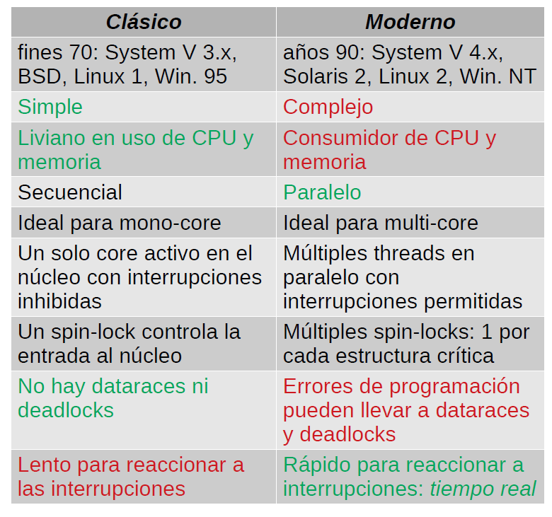
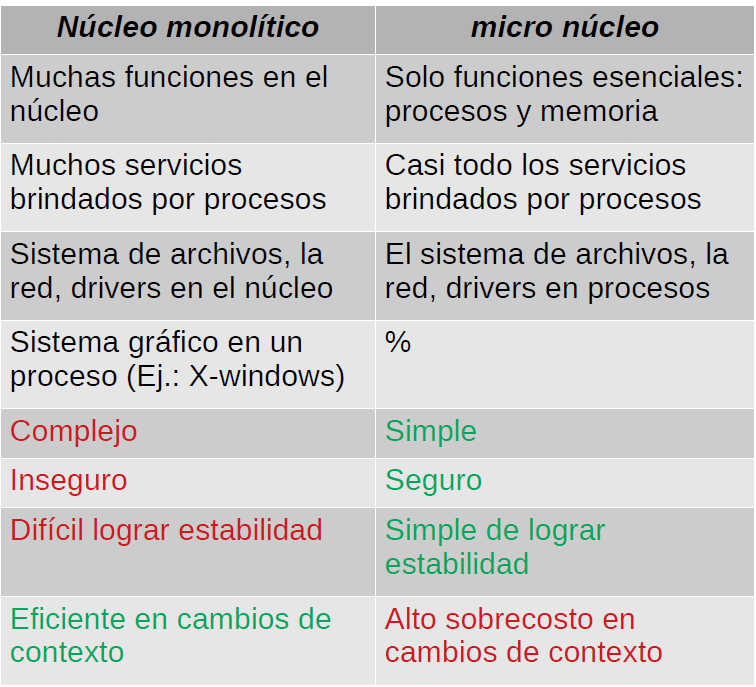
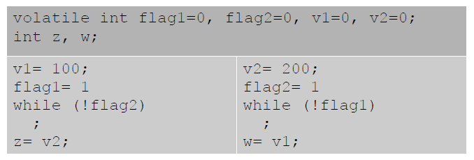

# Nucleo Clasico vs. Nucleo Moderno




# Nucleo Monolitico vs. Micro Nucleo



# El Scheduler de Linux

* Es interesante poruqe reune caracteristicas de round robin, prioridades y shortest job first.
* Implementa tajadas de tiempo (time slicing).
* Implementa prioridades estaticas y dinamicas.
* Le da prioridad a los procesos con rafagas cortas como los procesos intensivos en entrada/salida o procesos interactivos. Si aumenta el tiempo de la rafaga, le disminuye la prioridad dinamica al proceso.
* Cumple con los requisitos de tiempo real: todos los calculos se realizan en un tiempo acotado por una constante.
* Le da prioridad a los procesos establecido como de tiempo real, pero requiere privilegio de administrador (root). El scheduler le da una prioridad mucho mas alta a estos procesos.

# Prioridad Estática

* La prioridad estatica va entre -20, la mejor prioridad, hasta 19, la peor.
* 0 es la prioridad estandar: la de shell.
* Se estalece con el comando `nice(1)`:

  ```
  nice -n[=pri] comando ...
  ```

* Ejecuta el comando sumandole `pri` puntos a las prioridad del shel de comandos, lo que se traduce en peor prioridad.
* O tambien la llamada al sistema `nice(2)`.
* Los usuarios normales solo pueden empeorar la prioridad de sus procesos (en la nueva API se puede subir la prioridad).
* Solo root puede mejorar la prioridad de un proceso usando la llamada a sistema `nice(2)`.
* **La prioridad estatica solo se usa para calcular la duracion de la tajada de tiempo como: (20 - prioridad estatica) x 10**
* Los procesos con mejor prioridad estatica tienen tajadas mas extensas.

# Prioridad Dinamica

Se calcula de la siguiente manera:
* Cada vez que un proceso completa una rafaga, se resta la duracion de esa rafaga a lo que le queda de **tajada** (**time slicing**) y tambien a su **tiempo dormido**.
* Cada vez que un proceso pasa a estado READY, se suma la duracion de su estado de espera a su **tiempo dormidob.**
* El **tiempo dormido** no puede bajar de 0 segundo o exceder un segundo.
* Los procesos intensivos en entrada salida tienen un tiempo dormido cercano a 1 segundo, mientras que los intensivos en CPU se acercan a 0.
* Cuando un proceso pasa a estado READY se le entrega un **bono** calculado como $\left \lfloor  tiempo \ dormido/100\right \rfloor$ lo que da un valor entre 0 y 10.
* La **prioridad dinamica** es: **prioridad estatica**+21-**bono**+5
* No puede bajar de 1 ni exceder 40.
* **El scheduler sie,pre elige ejecutar el proceso con la prioridad dinamica de menor valor.**

# Cola de Activos y Cola de Expirados

* Cola de expirados: Procesos que agotaron su tajada de tiempo.

* **El scheduler solo elige procesos de la cola de activos.**
* Cuando un proceso agota su tajada, pasa a la **cola de expirados** y ya no es elegible por el scheduler por un rato.
* Cuando el scheduler se encuentra con la **cola de activos** vacia, intercambia la **cola de expirados** por la **cola de activos** con lo que los procesos que habian completado su tajada de tiempo vuelve a ser elegibles por el scheduler.
* La prioridad dinamica de un proceso se calcula una sola vez: cuando pasa a estado READY.
* Cada nivel de prioridad dinamica tiene su propia cola FIFO.
* Agregar o extraer procesos toma tiempo constante.
* El scheduler mantiene una mascara de bits que indica las colas que no estan vacias.
* Determinar cual es la cola no vacia con mejor prioridad toma tiempo constante.
* Los procesos de tiempo real tienen prioridad inferior a 1.

**OBS: El scheduler de Linux combina balanceadamente las ventajas de round robin, prioridades y shortest job first.**

# Problema

* 2 threads ejecutan cada uno este codigo:



* Arriba se muestran las variables compartidas y globales. Luego se muestran las variables de cada thread.
* Al terminar se espera que `z` sea 200 y `w` sea 100.
* Asi será si el **modelo de consistencia de memoria** es secuencial.
* Pero no si es **relajado**.
* El primer thread puede ejecutar `v1=100` seguido de `flag1=1`.
* Pero el segundo thread podria ver que primero ocurrió `flag1=1` y luego `v1=100`.
* En tal caso `w` podria quedar en 0!
* Se evita usando un mutex o un semaforo.
* Los compiladores optimizan el codigo, ejecutando las lineas en un posible orden distinto al cual se declararon.

# Modelos de consistencia de memoria

* So las reglas de ordenamiento de los accesos a la memoria en un computador multi-core.
* En el **modelo de consistencia de memoria secuencial** todos los cores ven un mismo orden en los accesos a memoria.
  * Es simple de implementar cuando todos los cores comparten el mismo bus para acceder a la memoria. Sin embargo, cuando aparece la memoria cache, ya no es un modelo de memoria de consistencia secuencial.
* Pero en computadores modernos, para mayor eficiencia, cada core tiene sus propios canales de memoria.
* La mayoria de los accesos de un core van a sus propios canales de memoria.
* Lineas de comunicacion entre cores permiten acceder a la memoria de otros cores, transparentemente, como si fuese memoria propia, aunque no tan rapidamente: **Non Uniform Memory Access (NUMA)**.
* Los cores pueden ver ordenes de acceso diferente a la memoria, lo que abre el camino a los **modelos de consistencia de memoria relajados**.

# Consistent Locking Behavior

* Para evitar los dataraces, un programador debe usar consistentemente mutex para ordenar los accesos a la memoria.
* Significa que cada vez que dos cores acceden a ua misma direccion de memoria `d`, con uno modificando esa direccion, debe existir un mutex `m` tal que un core solicitó el mutex `m` antes del acceso a `d`, lo liberó despues del acceso, el segundo core solicitó `m`, accedió a `d` y finalmente liberó `m`, en ese orden.
* La sincronizacion con el mutex usa la instruccion `swap` que es una **barrera de memoria**: si un core hizo un acceso a memoria antes del `swap`, el resto de los cores tambien deben ver ese acceso ocurrir antes del `swap`.
* **Sanitize** para threads verifica que se cumple el consistent locking behavior.
  * Si detecta un problema, es altamente probable que tenga un datarace.
  * Problema: falsos positivos.

# Conclusiones

* La programacion multi-core es mas complicada de lo que parece.
* Evitela a menos que realmente tenga problemas de eficiencia.
* Si recurre a ella, verifique sus programas con sanitize para threads.
* Sea cosistente en usar un mutex para ordenar los accesos a la memoria compartida.
* Si es posible, recurra a procesos que no comparten la memoria.

