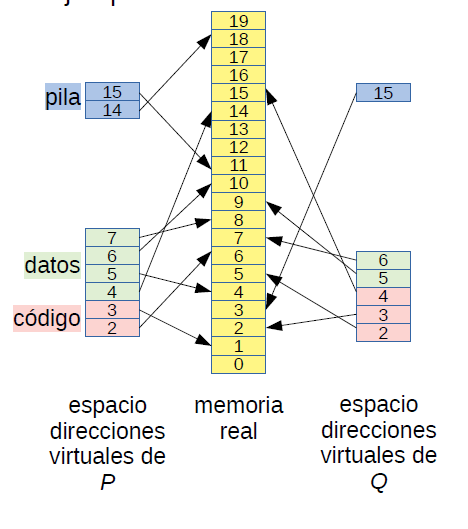
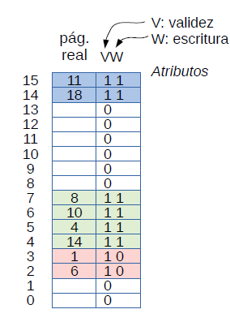
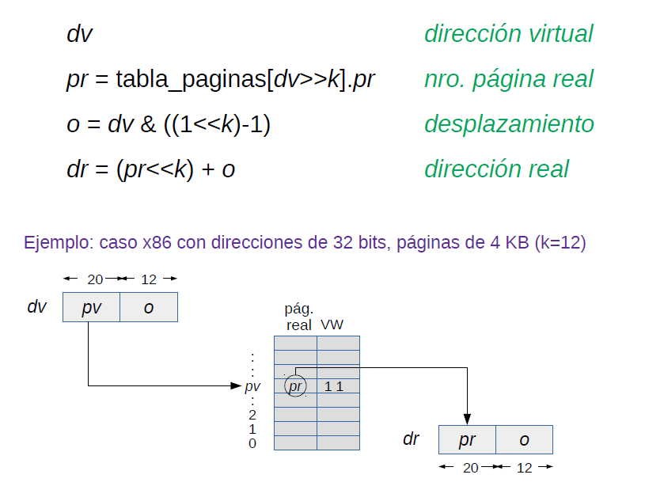
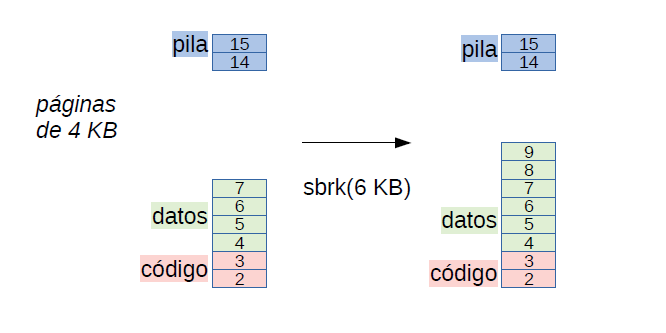
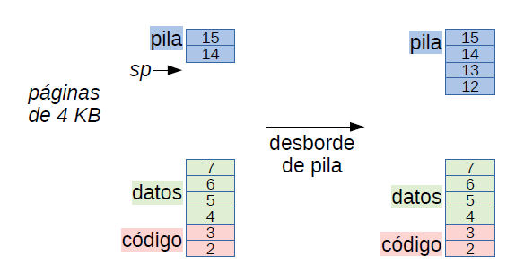
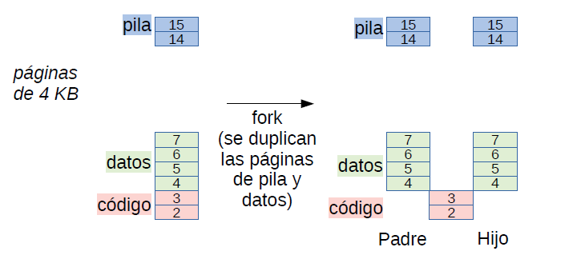
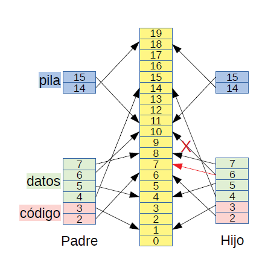

# Administracion de Memoria

* Implementacion de espacios de direcciones virtuales. Se necesita para lograr proteccion entre procesos. Existen dos mecanismos:
  * Segmentacion (Obsoleto)
  * Paginamiento: Todos los computadores de uso general implementan hoy en dia este mecanismo, desde servidores hasta smartphones. Solo se excluyen microprocesadores economicos para sistemas embebidos.

# Paginamiento

* El espacio de direcciones virtuales y la memoria real del computador (memoria fisica) se descompone en paginas.
* La pagina:
  * Su tamaño está fijado por la arquitectura del procesador: 4 KB en x86.
  * Es una potencia de 2: 4 KB = $2^{12}$ B
  * Las paginas se enumeran como 0, 1, 2, 3, etc.
  * Sea $S$ el tamaño de la pagina, este será igual a $2^k$.
  * Comienza en una direccion que es multiplo del tamaño de la pagina: pagina $p$ comienza en direccion $p * S = p<< k$.
  * Sea $d$ la direccion de memoria.
  * El tamaño de la pagina es una potencia de 2 para que sea facil obtener el numero de pagina a partir de una direccion $d$ con $shift$:
  
    $p=\frac{d}{S}=d>>k$
  * $p$ se obtiene ignorando los $k$ bits menos significativos de la direccion.
* **Paginas virtuales:** Las paginas de un proceso.
* **Paginas reales:** Las paginas de la memoria real.

# Espacio de direcciones virtuales

* La pagina virtual `pv` de un proceso reside en alguna pagina real `pr`.
* En general `pv`$\neq$`pr`.
* Ejemplo:

  

  * Se observa que las paginas reales de los procesos P y Q son disjuntas, por tanto no puede interferir ninguno de los dos con el otro.
  * Para este mapeo se necesita de una estructura de datos que llamaremos **Tabla de Paginas**.
  * Tabla de paginas para proceso P :

  

  * El atributo de validez `V` indica si la pagina virtual es valida o no.
  * El atributo de escritura `W` muestra si es posible o no escribir en la pagina.

# Tabla de paginas

* Cada proceso tiene su propia tabla de paginas.
* Almacena la ubicacion de cada pagina virtual en la memoria real.
* Se subindica por el numero de la pagina virtual.
* Con esto se obtiene el numero de la pagina real en donde reside.
* Los atributos indican qué se puede hacer con esa pagina:
  * $V$: Es el **bit de validez**. Si el proceso accede a una pagina con bit $V$ en 0 se gatilla una interrupcion llamada **page fault**.
  * $W$: Es el **bit de escritura**. Si el proceso escribe en una pagina con bit $W$ en 0 tambien se gatilla un **page fault**.

# Traduccion de direcciones virtuales a direcciones reales

* El programador ve las direcciones virtuales, nunca las direcciones reales.

Cada vez que el proceso accede a una direccio virtual `dv` la **memory management unit (MMU)** del procesador traduce `dv` a una direccion real `dr` de esta manera:
    

# TLB: Translation Lookaside Buffer

* Cada vez que se realiza un acceso a la memoria hay que realizar un segundo acceso a la tabla de paginas, por lo que es **ineficiente**. Tiene un 100% de sobrecosto en accesos a memoria.
* La solucio es TLB.
* La TLB es u cache de traducciones de paginas.
* Tamaño: almacena ~1024 traducciones hoy en dia.
* En cada caso a una pagina `pv`:
  * Si (`pv`, `pr`) está en la TLB, `pr` es su traduccion, por tanto no existe un sobrecosto alguno en tiempo de ejecucion.
  * En caso contrario: Obtener (`pv`, `pr`) de la tabla de paginas en memoria con un sobrecosto de un acceso a memoria adicional, y almacenar (`pv`, `pr`) en la TLB. Como la TLB tiene un tamaño fijo se debe reemplazar este par por algun otro de la TLB.
  * El ~99% de los accesos a memoria encuentran la traduccio de la pagina en la TLB.
* Los procesadores hoy en dia realizan la busqueda del dato en el cache L1 (nivel/level 1) se hace usando su direccion virtual al mismo tiempo que se busca la direccion en la TLB.
* Si el dato no está en el cache L1 se busca en el cache L2 usando su direccion real.

# Cambio de contexto

* El hardware de cada core tiene un registro `TP` con la direccion de la tabla de paginas del proceso en ejecucion en ese core.
* **La direccio de la tabla de paginas de un proceso se almacena en su descriptor de procesos y es ua direccion real. (si no fuese una direccion real, seria una recursio infinita.)**
* En un cambio de contexto de un proceso a otro proceso hay que cambiar el registro `TP` por la tabla de paginas del proceso entrante.
* Tambien se debe invalidar la TLB.
* E invalidar el cache L1 porque se consulta usando direcciones virtuales.
* No es necesario invalidar caches L2 y L3 porque se consultan usando direcciones reales.
* Invalidar cache L1 es caro en tiempo de ejecucion: varias microsegundos, no tanto invalidar la TLB.
* **Si el cambio de contexto es a otro thread dentro del mismo proceso, no es necesario ivalidar la TLB o el cache L1 porque se continua en el mismo espacio de direcciones virtuales.**
* **Por eso a los threads se les llama procesos livianos y a los procesos Unix procesos pesados, porque el cambiomde contexto de los threads es mas rapido.**

# El potencial del paginamiento 

## Ventaja 1

* Se generan espacios de direcciones virtuales.
* **Proteccion entre procesos.**
   *  Un proceso no puede leer o modificar la memoria de otro proceso.
* Extension explicita de los datos.
  * Cuando se le acaba la memoria a `malloc`, solicita mas memoria con la llamada a sistema `sbrk`.

  

  * Entrega dos paginas solamente, pues deben ser potencia de 2.

## Ventaja 2

* Extension implicita de la pila en caso de desborde.
  * Cuando ocurre un **page fault** con una direccion en el rango de la pila (mayor que `sp`), **el nucleo extiende automaticamente el tamaño de la pila.**

  

* Implementacion **ineficiente** de fork:

  

  * Las paginas virtuales son identicas pero se mapean a paginas reales distintas.
  * Como el codigo no se modifica, este no necesita una copia.

## Ventaja 3

* Implementacion **eficiente** de `fork`
  * Paginas no se duplican.
  * Padre e hijo comparten sus paginas.
  * Atributo $W$ se coloca en 0 en todas las paginas.
  * Se agrega el atributo **copy on write (COW)**: Se coloca en 1 en las paginas que tenia $W$ en 1. Asi se genera una copia de estas paginas.
  * Si se escribe en pagina 6 se gatilla un **page fault** y solo entonces el nucleo duplica la pagina, cambiando el atributo **W** a 1.

  

  * Esta estrategia privilegia el uso mas habitual de `fork`: el shell de comandos lo usa para lanzar un nuevo proceso ejecutando la secuencia `fork`/`exec`.
  * Entre `fork` y `exec` se modifican muy pocas paginas.
  * Cuando el hijo invoca `exec`, se descarta ese espacio de direcciones virtuales.
  * Es eficiente porque en la mayoria de los casos se duplican pocas paginas.
  * Pero es ineficiente si el `fork` no va seguido de `exec`, por ejemplo cuando se usa para paralelizar.
  * Mejora: Si no hay `exec` despues de duplicar ~10 paginas, duplicar todo el proceso.

## Ventaja 4

* **Swapping**
  * Cuando la memoria escasea se llevan procesos completos a disco.
  * Se graba en disco una copia al byte de las paginas de un proceso.
  * Se cambia el estado del proceso a **swapped.**
  * Las paginas liberadas se utilizan para los procesos que quedan en memoria.
  * No se puede ejecutar un proceso mientras está en disco.
  * Es ingrato para el usuario que está detras de un proceso interactivo porque podria no haber respuesta hasta por un minuto.
* Mejor: **Paginamiento en Demanda**
  * Se llevan a disco las paginas no usadas recientemente por algun proceso.
  * Se marcan como invalidas pero con un atributo adicional `S` que indica que estan grabadas en disco.
  * El proceso propietario puede continuar ejecutandose.
  * Si el proceso accede a una pagina en disco, se gatilla un **page fault** y el nucleo carga transparetemente la pagina en memoria nuevamente.