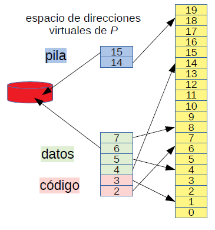
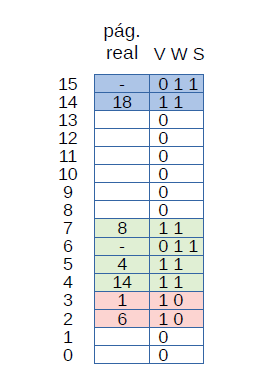
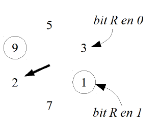
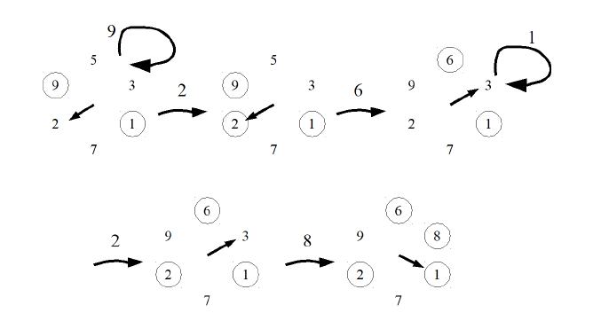

# Paginamiento en demanda

* Se llevan a disco las paginas no usadas recientemente por algun proceso.
* Se marcan como invalidas pero con un atributo adicional `S` que indica que estan grabadas en disco.
* El proceso propietario puede continuar ejecutandose.
* 
  

* Si el proceso accede a una pagina en disco, se gatilla un **page fault** y el nucleo carga transparetemente la pagina en memoria nuevamente.

  

# Reemplazo de paginas

* Considere un proceso **P** que accede a una pagina **v** residente en disco, se necesita traerla a memoria.
* Hay que encontrar una pagina real **r** en donde colocar la pagina virtual **v** de **P**.
* Como la memoria escasea, hay que elegir una pagina **w** de un proceso **Q** (o **P**) residente en memoria.
* Se lleva **w** a disco.
* En la tabla de paginas de **Q**, en la posicion **w**.
  * Se marca el atributo **V** en 0 para que cuando Q acceda a w gatille un **page fault**.
  * Se rescata el campo pagina real en **r**: es dode se colocará **v**.
  * Tambien se coloca su atributo `S` (**saved**) en 1 porque hay que distinguir entre paginas grabadas en disco de paginos no atribuidas al proceso `Q` y que deben gatillar la señal SIGSEGV (**segmentation violation**).
* Se lee la pagia virtual `v` de `P` en la pagina real `r`.
* En la tabla de paginas de `P`, en la posicion de pagina `v`:
  * Se coloca el atributo de validez `V` de la pagina `v` en 1.
  * Se coloca el campo pagina real en `r`.
* Se invalida la TLB y el cache L1.

# Estategias de reemplazo de paginas

* El desempeño del paginamiento en demanda depende de una buena eleccion de la pagina `w` que se irá a disco.
* El cómo se elige `w` se conoce como **estrategia de reemplazo de paginas**.

## Estrategia ideal

Se elige aquella pagina que será usada en el futuro mas lejano.
* Minimiza el numero de page faults.
* No se puede implementar porque no se conoce el futuro.
* Se usa solo como referencia para hacer comparaciones.

## Estrategia FIFO

Se elige la pagina que lleva mas tiempo en memoria.
* Facil de implementar.
* Es inutilizable debido al pesimo desempeño.

## Estrategia aleatoria

Se elige una pagina al azar.

* Pesimo desempeño en paginamiento en demanda.
* Se usa en la estrategia de reemplazo de la TLB y de las memorias cache.

## Estrategia LRU (Least Recently Used)

Se elige la pagina que lleva mas tiempo sin ser referenciada.

* Se basa en que el pasado es buen predictor del futuro.
* Si una pagina lleva mucho tiempo sin ser referenciada, probablemente va a pasar otro tanto sin ser referenciada.
* Excelente desempeño acercadose a la estrategia ideal.
* Practicamente imposible de implementar.

Estrategias que sí se usan:
* **Estrategia del reloj.**
* **Estrategia del working set.**

# La estrategia del reloj

* Aproximacion de LRU.
* Escoge una pagina que lleve bastante tiempo sin ser referenciada.
* Usa el **bit de referencia** `R` en la tabla de paginas.
* La MMU coloca automaticamente el bit `R` en 1 cuando se referencia la pagina asociada.

Es mejor explicar la estrategia con un ejemplo:



* La figura muestra un computador con 6 paginas reales.
* Las paginas virtuales que tienen el bit `R` en 1 aparecen en un circulo, el resto tiene el bit `R` en 0.
* Por simplicidad consideraremos un solo proceso.
* El cursor (flecha) avanza en el sentido de los punteros del reloj.
* **Una traza es una secuencia de paginas referenciadas por un proceso**. Ej: 9 2 6 1 2 8
* Diagrama de las transiciones:

  

   * La pagina 6 provoca un page fault, por tanto se desmarca la pagina 2 que tenia el bit `R` en 1 y se avanza a la siguiente pagina, luego se realiza el mismo proceso para la pagina 9. Luego, como la pagina 5 no se ha referenciado en un tiempo largo se envia a disco y se agrega la pagina 6 marcando el bit `R` de esta en 1. Finalmente, se avanza el cursor a la siguiente pagina.

## Estrategia en pseudo-codigo

Cuando ocurre un page fault:

```c
while (bitR(cursor()) == 1) {
  setBitR(cursor(), 0);
  avanzarCursor();
}
reemplazarCursor();
avanzarCursor();
```

## Propiedades de la Estrategia del Reloj

* **Caso multiples procesos:** Se consideran todas las paginas por igual, sin distinguir a qué proceso pertenecen.
* Tiempo que toma el cursor en dar una vuelta es el tiempo que se considera suficiente para reemplazar una pagina si no ha sido referenciada en toda la vuelta.
* Depende de la cantidad de page faults, que depende a su vez de la localidad de los accesos:
  * Buena localidad implica un mayor tiempo entre vueltas.
  * Mala localidad implica un menor tiempo entre vueltas.
* **Situacion anomala:** Todas las paginas fueron referenciadas.
  * Se da la vuelta completa
  * No es relevante porque se da cuando hay pocos page faults.
* Ventajas:
  * Simple de implementar.
  * Sobrecosto cero cuando la memoria es abundante.

# El problema de la estrategia del reloj
* **Trashing:**
  * Hay demasiados page faults.
  * Todos los procesos estan en espera del reemplazo de una pagina.
  * Apenas se retoma un proceso, sufre un page fault y vuelve al estado de espera.
  * La CPU tiene un porcentaje de ocupacion cercao a 0%.
  * El disco para paginamiento se ocupa al 100%.
  * La unica solucion es que el administrador mate algunos procesos pero el shell de comando de root tampoco avanza.
  * Se produce cuando hay multiples procesos, porque si bien cada proceso exhibe localidad de accesos, cuando el scheduler los ejecuta en tajadas de tiempo, pierden su localidad.
  * Solucion: el **working set**.