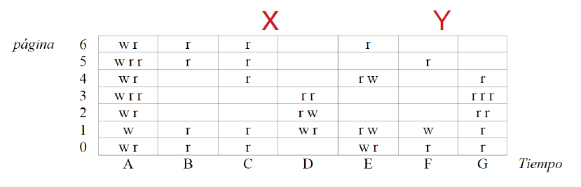

# La estrategia del Working Set

* Combina el paginamiento en demanda con swapping.
* Basada en el **calculo del working set** para cada proceso.
* La principal ventaja es que evita el trashing.
* Pero agrega un sobrecosto fijo: calcular los working set.
* Idealmente es mejor usar la estrategia del reloj, pero si sube demasiado la tasa de page faults, cambiar a working set.
* Definicion:
  **El working set de un proceso P en el intervalo de tiempo virtual [t, t'[ es el conjunto de paginas referenciadas por P.**
* El working set de P se recalcula cada $\Delta t$ segundos para los ultimos **$\Delta t$ segundos de uso de tiempo de CPU** por parte de P.
* **Estrategia del working set**:
  * **Despues del calculo del working en un intervalo los bits R de las paginas virtuales se debe resetear a 0 para calcular el siguiente working set.**
  * Mantener working set de cada proceso en memoria.
  * En caso de page fault se reemplaza una pagina que no pertenezca al working set de ningun proceso.
  * Si no hay suficiente memoria para la suma de los working set: recurrir a swapping, llevar a disco procesos completos.

## Implementacion del working set

Cada $\Delta t$ segundos de uso de tiempo de CPU por parte de P, calcular su working set:

Para toda pagina $q\in P$ ( $q$ pagina virtual) residente en memoria real:

```c
if (bitR(q) == 1) {
  setBitWS(q, 1)
  setBitR(q, 0)
}
else {
  setBitWS(q, 0)
}
```

Cuando ocurre un page fault se elige la pagina $q$ que será reemplazada con:

```c
for (;;) {
  Sea una pagina q cualquiera tal que bitWS(q) == 0
  Si no existe q {
    swapping()
  }
  else {
    if (bitR(q) == 0) return q
    setBitWS(q, 1)
  }
}
```

* Un proceso no puede ejecutarse eficientemente si su working set no cabe en memoria, pero todavia se puede achicar $\Delta t$ para disminuir el tamaño de su working set.

## Ejemplo de working set



* Working Sets, para periodos de tiempo A, B, ..., G:
  * A: Todas las paginas.
  * B: 0 1 5 6.
  * C: 0 1 4 5 6.
  * D: 1 2 3.
  * E: 0 1 4 6.
  * F: 0 1 5.
  * G: 0 1 2 3 4.

**OBS: El working set se calcula al finalizar el proceso, es decir, cuando empieza el siguiente. Hay que tener esto en cuenta para ver el ejercicio.**

Ejercicio:
* Considerar que todas las paginas de este proceso residen en memoria.
* En $X$ e $Y$ se producen 2 page faults asociados a otros procesos, Cuales paginas de este proceso se podrian reemplazar para el page fault $X$? Y para el page fault $Y$?
  * Para el de X se puede reemplazar las paginas: 2 y 3. La 4 no es posible pues en B el bit WS = 0 pero despues el bit de referencia R = 1, por tanto no se considera.
  * Para el de Y se puede reemplazar las paginas: 2 y 3.


# Optimizaciones para paginamiento en demanda

* Grabar en disco solo paginas que se hayan modificado.
  * Al recuperar una pagina $q$ de disco, colocar el **bit dirty** en 0.
  * La MMU coloca automaticamente bit dirty en 1 cuando se escribe en $q$.
* Si el disco de paginamiento está desocupado, elegir cualquier pagina $q$ con `bitWS(q)=0` y `bitR(q)=0`:
  * Grabar q en disco.
  * Colocar bit dirty en 0.
* Tratar de que el 20% de las paginas reales disponibles para procesos no pertenezca al working set de ningun proceso:
  * Si es menor que 20% recurrir a swapping.
  * Si es mayor que 20% recuperar procesos de disco.
* Tratar de que la tasa de page faults de cada proceso sea por ejemplo de 10 page faults por segundo:
  * Un disco moderno permite atender unos 100 page faults por segundo, cuando no hay que escribir la pagina de reemplazo.
  * 10 page faults significarian aproximadamente un 10% de sobrecosto en tiempo de ejecucion.
  * Si es mayor que 10 page faults: agrandar $\Delta t$ para ese proceso.
  * Si es menor que 10 page faults: disminuir $\Delta t$ para ese proceso.