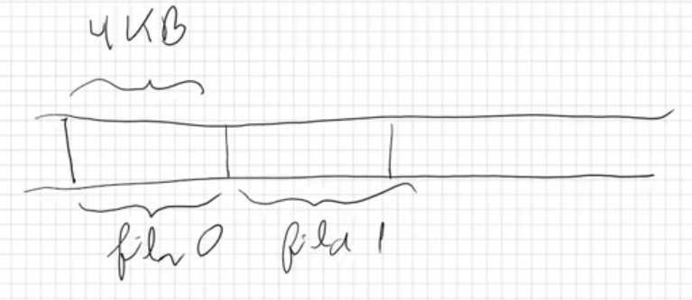
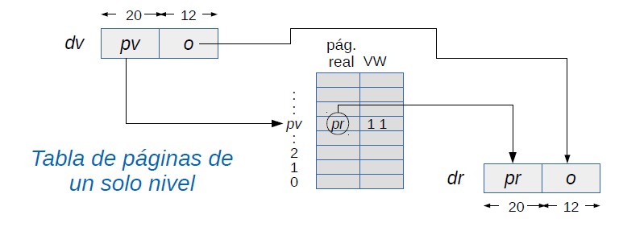
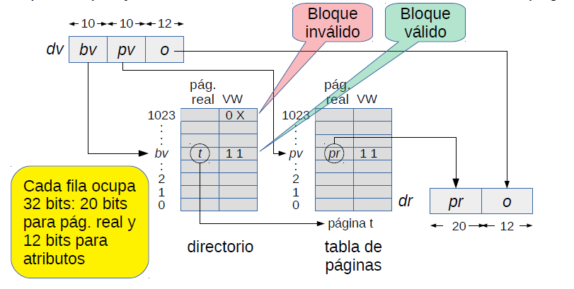
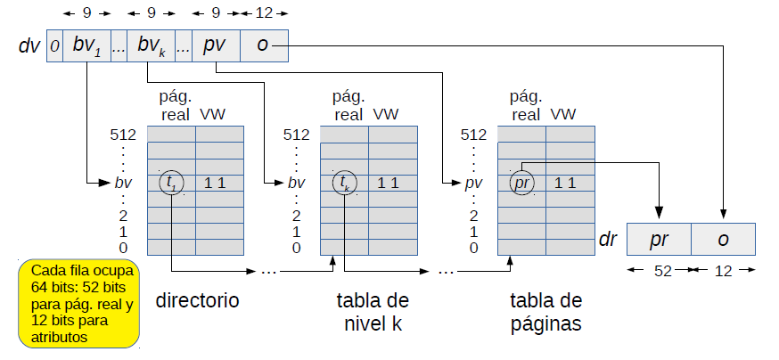

# Localidad de los accesos

* Localidad de los accesos a variables locales (en la pila): excelente (normalmente la pila es de pequeño tamaño, por ej. dos paginas).
* Localidad de los accesos al codigo: buena.
* Localidad de los acceso a datos: depende de los algoritmos y estructuras de datos que se utilizan.
  * Acceso secuencial a arreglos de gran tamaño: mala.
  * quicksort: mala localidad al comienzo cuando hay que particionar el arreglo completo, pero excelente localidad a medida que se ordenan arreglos cada vez mas pequeños.
  * Listas enlazadas, arboles binarios y objetos en general: mala localidad especialmente cuando el heap se encuentra muy fragmentado; basta refenciar un solo objeto de una pagina para que toda esa pagina deba residir en memoria.
* Ademas hay que considerar los desacierto en la TLB.
  * Considere por ejemplo sumar los elementos de una matriz de 512 $\times$ 512 completamente residente en memoria almacenada por filas en la memoria del computador, ¿cual recorrido de la matriz es mas eficiente? ¿por filas o por columnas?

  
  * Recorrido por filas: Se realizan 512 accesos a memoria, produciendo 512 desaciertos por cada vez que pasamos a una siguiente pagina. 
  
    ```c
    double m[512][512];
    ...
    double s=0;
    for (int i=0; i<512; i++)
      for (int j=0; j<512; j++)
        s+=m[i][j];
    ```
  * Recorrido por columnas: Como al pasar de una columna a otra se cambia de pagina se tienen 512 desaciertos, luego en total se obtienen 512 $\cdot$ 512 desaciertos.

    ```c
    double m[512][512];
    ...
    double s=0;
    for (int j=0; j<512; j++)
      for(int i=0; i<512; i++)
        s+=m[i][j];
    ```

  Asi se debe recorrer siempre las matrices por filas.

# Implementacion de la estrategia del reloj para un nucleo clasico monocore

* Se invoca cuando ocurre un pagefault, es decir, $bit V == 0$ o el acceso fue una escritura y $bitW==0$.

```c
void pagefault(int page) {
  Process *p = current_process; // propietario de la pagina
  int *ptab = p->pageTable;
  if (bitS[ptab[page]]) // Esta la pagina en disco?
    pageIn(p, page, findRealPage()); // si, leerla de disco
  else
    segfault(page); // sino, entonces es un segfault
}

// Recupera de disco la pagina page
// del proceso p colocandola en realPage

void pageIn(Process *p, int page, int realPage) {
  int *ptab = p->pageTable;
  setRealPage(&ptab[page], realPage);
  setBitV(&ptab[page], 1);
  loadPage(p, page); // retoma otro proceso
  setBitS(&ptab[page], 0);
  purgeTlb(); // invalida la TLB
  purgeL1(); // invalida cache L1
}

// Graba en disco la pagina page del proceso q

int pageOut(Process *q, int page) {
  int *qtab = q->pageTable;
  int realPage = getRealPage(qtab[page]);
  savePage(q, page); //retoma otro proceso
  setBitV(&qtab[page], 0);
  setBitS(&qtab[page], 1);
  return realPage; // retorna la pagina real en donde se ubicaba
}

// Variables globables
Iterator *it; // =processIterator();
Process *cursor_process = NULL;
int cursor_page;

int findRealPage() {
  //Recorre las paginas residentes en memoria de todos los procesos buscando una
  // pagina que no haya sido referenciada en  toda una vuelta del reloj
  int realPage = getAvailableRealPage();
  if (realPage>=0) // Quedan pagina reales disponibles ?
    return realPage; // Si, retornamos esa pagina
  // no, hay que hacer un reemplazo
  for (;;) {
    if (cursor_process == NULL) { //Quedan paginas en proceso actual?
      //no
      if (!hasNext(it)) // Queda procesos por recorrer?
        resetIterator(it); //partiremos con el primer proceso nuevamente
      cursor_process=nextProcess(it); //pasamos al proximo
      cursor_page=cursor_process->firstPage; //primera pagina  
    }
    // Estamos visitando la pagina cursor_page del proceso cursor_process
    int *qtab = cursor_process->pageTable;
    // mientras queden paginas por revisar en cursor_process
    while (cursor_page<=cursor_process->lastPage) {
      if (bitV(qtab[cursor_page])) { //Es valida?
        if (bitR(qtab[cursor_page])) // no fue referenciada
          setBitR(&qtab[cursor_page], 0);
        else // si, se reemplaza la pagina cursor_page de cursor_process
          return pageOut(cursor_process, cursor_page++);
      }
      cursor_page++;
    }
    // Se acabaron las paginas de cursor_process
    // hay que buscar en el proximo proceso
    cursor_process = NULL;
  }
}
```

## Ejercicio: Reimplemente la misma estrategia del reloj pero considerando una MMU que no implementa el bit R

Ver clase 19 pags 6-8

# Problema: tamaño de la tabla de paginas

* En x86 un proceso puede direccionar hasta 4GB: $2^{20}$ paginas.
* Por tanto un proceso que puede direccionar hasta 4GB necesita una tabla de paginas de 4MB (demasiado sobrecosto).
* Incluso para procesos que ocupan poca memoria.
* Con direcciones de 64 bits la tabla deberia ser aun mas gigantesca.
* Alternativamente se pueden usar tablas de paginas mas pequeñas pero reduciendo el tamaño maximo de memoria redireccionable por los procesos.
* Solucion: **tablas de pagina de multiples niveles.**



# Tablas de paginas de 2 niveles en x86

* El espacio de direcciones virtuales de un proceso se descompone en 1024 bloques, cada uno de 4MB (1024 paginas de 4KB).
* Para traducir las direcciones de un solo bloque se necesita una tabla de paginas que ocupa exactamente una pagina d ela memoria (4KB).
* Ademas se agrega una nueva tabla: **el directorio**, que ocupa una pagina (4KB) y que contiene los numeros de pagina de las tablas de paginas para cada bloque (hasta 1024 tablas).
* Un proceso pequeño que entre codigo y datos requiere menos que 4MB necesita una tabla de paginas para codigo y datos, otra tabla para la pila y finalmente el directorio: sobrecosto total es de 3 paginas.



# Tablas de paginas de n niveles en x86-64

* Las direcciones virtuales y reales son de 64 bits y por lo tanto las tablas solo pueden almacenas 512 filas.
* Cada proceso tiene $n$ niveles de tablas de paginas.
* El primer nivel es el directorio y tiene 512 filas de 64 bits con paginas reales que almacenan tablas de segundo nivel.
* En el nivel $k$ cada tabla tiene 512 filas de 64 bits con paginas reales que almacenan tablas de nivel $k-1$, con $1<k<n$.
* En el nivel $n$ cada tabla tiene 512 filas de 64 bits con las paginas reales atribuidas a un bloque de 2MB del proceso.
* Amd64 define 4 niveles con direcciones de 48bits (los restantes son 0).
* Puede direccionar hasta $4KB\cdot  512^4 = 256TB$
* 
