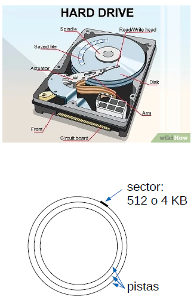
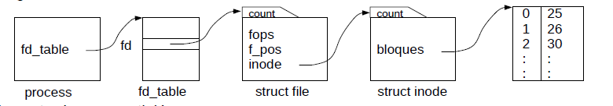
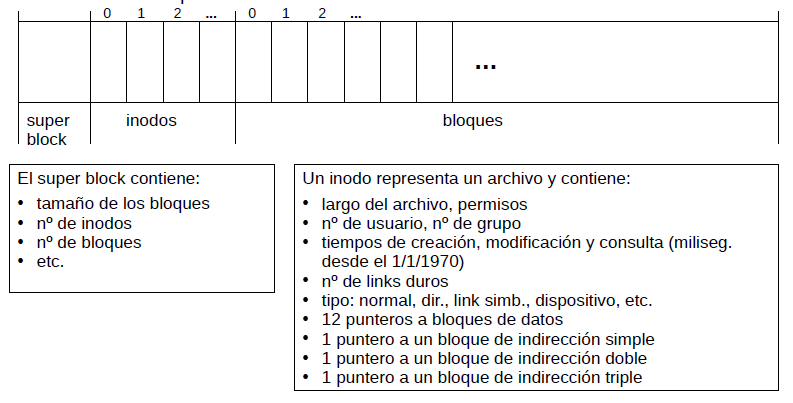
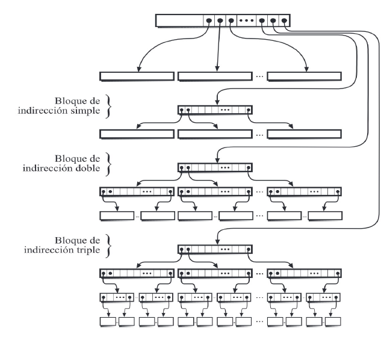
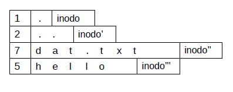
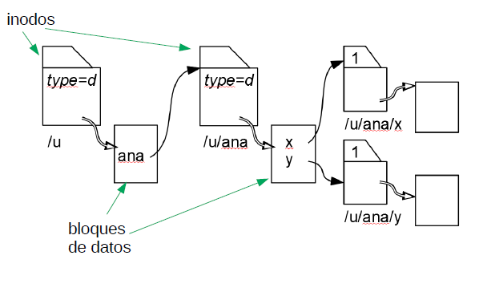

# El sistema de entrada/salida

Organizacion en capas, cada capa se encarga de resolver un problema, capas que se ejecutan en orden al usar un archivo:
* Decodificacion.
* Sistema de archivos.
* Cache de disco.
* Scheduler de accesos a disco.
* Driver.
* Disco o SSD.

# Capa: Decodificacion

* La API de Unix uniformiza la E/S para archivos, dispositivos y otras abstracciones por medio de `open`, `read`, `write`, `close`, etc.
* El procesamiento intero es muy distinto segun la naturaleza de la abstraccion.
* Todo parte a nivel del proceso del usuario con la llamada a `open`:

  ```c
  int fd = open(nombre, modo);
  ```

* La implementacion de esta funcion esta en el nucleo del sistema operativo.
* `open` retorna un entero `fd` denominado **file descriptor** que será usado por el proceso en operaciones como `read`, `write` y `close`.
* Para cada proceso el nucleo mantiene un arreglo con los descriptores abiertos.
* `fd` se usa para indexar el arreglo recuperando una estructura de tipo `struct file` con el estado de la abstraccion.
* El puntero `fops` en esta estructura es la direccion de otra estructura de tipo `file_operations` con punteros a las funciones que implementan operaciones `read`, `write`, `close` y otras para esa abstraccion.
* Si el proceso invoca:
  ```c
  int rc = read(fd, buf, count);
  ```
* El nucleo decodifica qué funcion se encarga de esta lectura con:

```c
struct file *fil = process->fd_table[fd];
(*fil->fops->read) (fill, buf, count, &fil->f_pos);
```

# Capa: El disco

* Un drive contiene 2 o mas platos que almacenan los bits en pistas que se graban magneticamente.
* Cada plato se graba por ambos lados. 
  
  

* El brazo contiene cabezales para cada lado de todos los platos.
* El cabezal es microscopiico, mientras mas pequeño mayor es la densidad de bits del disco.
* El drive esta sellado porque cualquier grano de polvo dañaria el cabezal.
* Cuando el disco gira, el cabezal vuela sobre la superficie del disco sin tocarlo, el giro del disco produce una corriente que induce al cabezal a flotar. A la hora de que el disco se detenga el cabezal se mueve por inercia hacia una pista de aterrizaje designada, pues no puede parar en cualquier lugar del disco ya que generaria el daño de la informacion en el sector en donde caiga.
* Un tipico drive almacena 2TB en 2 platos que se pueden leer a unos 100 [MB/segundo].
* El problema es el acceso directo: mover el cabezal a otra pista del disco toma en promedio 10 milisegundos (se alcanzan apenas 100 operaciones por segundo). Un SSD puede hacer 40.000 operaciones por segundo.

# Capa: Sistema de archivos

* Para el caso de apertura de dispositivos como `/dev/mouse`, todo el proceso lo hace el driver.
* Para el caso de apertura de un archivo el acceso se descompone en capas adicionales:
  * Sistema de archivos.
  * Cache de disco.
  * Scheduler de disco.
  * Driver de disco.
  * Disco (o SSD).

* Sistema de archivos:
  * Ve una particion del disco como un **arreglo de bloques de datos**.
  * Se encarga de darle una estructura jerarquica de directorios y archivos.
  * **Su funcion mas importante es determinar en qué bloques de la particion se encuentra un archivo para pedirselos al cache de disco.**
  * se esfuerza en atribuir a los archivos sectores consecutivos del disco para que el acceso secuencial sea rapido, reduciendo el movimiento del cabezal del disco.
  * Un bloque se almacena en 1 o mas sectores del disco.

## Estructura del sistema de archivos

* Diagrama de acceso a un archivo:dd


* Formato de una particion:


* Un **puntero de indireccion simple** almacena 265 punteros a bloques de datos. Por otra parte un **puntero a un bloque de indireccion doble** almacena 256 punteros a punteros a bloques de indireccion simple, y así para el caso siguiente. Toda estos bloques generan un sobrecosto, por tanto no se crean a menos que sean utilizados, es decir, se crean cuando se llena el bloque, usualmente los bloques de indireccion doble y triple se ocupan para archivos de gran tamaño.

**OBS: Esto es para el caso en que un bloque es de tamaño 1KB, en caso de ser 4KB serian 1024 punteros.**

## Diagrama de bloques de un archivo

 

## Formato de directorios 

* Un directorio ocupa un inodo y bloques de datos como archivo normales. Basicamente guarda la informacion de los archivos que cuelgan del directorio.
* Por cada archivo perteneciente a ese directorio se almacena una fila de largo variable.
* El primer byte indica el largo del nombre del archivo en bytes.
* Luego viene el nombre.
* Finalmente 2 bytes que indican el numero del inodo que representa ese archivo.
* El nombre se almacena en el directorio, no en el inodo.
* Por ejemplo si un directorio contiene los archivos `dat.txt` y `hello`:


* Un directorio siempre contiene un link duro a si mismo (`.`) y un link duro del directorio padre (`..`).

## Ejemplo de diagrama de inodos, directorios y archivos

* La particion `/u` contiene el directorio `/u/ana` que a su vez contiene los archivos `x` e `y`.
* El siguiente diagrama muestra inodos, archivos y directorios.


  * `type` es una variable que indica el tipo del inodo, en este caso es un directorio por tanto es `type=d`.
  * Notar que el nombre del archivo no se encuenta en el inodo sino en el directorio.
  * Como se admiten links duros, en tal caso el nuevo inodo apuntará al mismo archivo que apunte el archivo del cual se creó el link duro.
  * El inodo tiene una variable que es un contador de la cantidad de links duros, es decir, inodos, que apuntan a ese archivo.
  * Para el caso de links simbolicos, se crea un inodo que apunta a un bloque de datos totalmente distinto al inodo del cual se creó, agregando el tipo simbolico `type = -s`.

# Capa: caché de disco

* Almacena los bloques recientemente usados de una particion.
* Ocupa tipicamente el 30% de la RAM del computador.
* Si se lee un bloque y no se encuentra en el cache se le pide al scheduler de disco que lo lea y se almacena en el cache reemplazando algun otro bloque.
* Lee mas bloques que los solicitados porque es probable que sí se soliciten pronto (**read-ahead**).
* Cuando se escribe, se escribe primero en el cache y se lleva a disco mas tarde (**write-after**).
* Un proceso **daemon** llamado update lleva a disco cada 30 segundos todas las escrituras pendientes.
* Tambien se puede hacer explicitamente invocando la llamada a sistema `sync` o el comando `sync`.

# Capa: Driver del disco.

* Implementa una API estandar para acceder a todos los tipos de disco: M.2, SATA, ATA, SCSI, etc.
* Ve el disco como un arreglo de sectores de 512 bytes (o 4096 bytes en discos de mas de 2TB).
* Accede directamente a los puertos de entrada/salidade la interfaz del disco para ejecutar comando de lectura o escritura de $n$ sectores a partir del $k$-esimo sector.