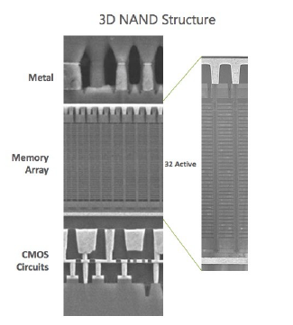
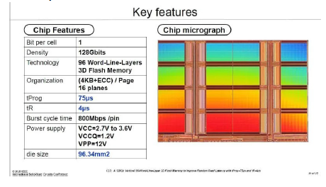

# Gestion de bloques disponibles

En algun momento el archivo crece de tamaño:

* Lo intuitivo es usar una lista enlazada de bloques disponibles.
* **Pero con el tiempo la particion se fragmenta: los archivos quedan disperson en el disco.**
* **Recuerde**: El sistema de archivos debe hacer todo lo posible porque los archivos queden contiguos en el disco.
* **Es mejor usar un vector de bits `disp` en donde `disp[i]` indica si el bloque `i` está disponible.**
* La variable `next` indica cual es el proximo bloque por revisar. Al revisar un bloque este tiene la variable que indica cual es el siguiente bloque a revisar.
* Cuando se necesita un nuevo bloque se revisa `disp[next]`, `disp[next+1]`, `disp[next+2]`, etc, hasta encontrar un bloque disponible.
* `next` se deja apuntando al bloque que no se alcanzó a revisar.
* Asi, los bloques asignados quedan suficientemente contiguos.
* **El vector de bits ocupa un espacio insignificante en la particion: un bit por cada bloque.**
* Anteriormente, es SOs antiguos, este puede desfragmentar el disco luego de un tiempo para reordenar los bloques de manera que los bloques asociados a un archivo se encuentren cercanos entre si.

# Capa: cache de disco

* Almacena los bloques recientemente usados de una particion.
* Ocupa tipicamente el 30% de la RAM del computador.
* Si se lee un bloque y no se encuentra en el cache se le pide al scheduler de disco que lo lea y se almacena en el cache reemplazando algun otro bloque.
* Lee mas bloques que los solicitados porque es probable que sí se soliciten pronto (**read-ahead**).
* Cuando se escribe, se escribe primero en el cache y se lleva a disco mas tarde (**write-after**).
* Un proceso **daemon** llamado update lleva a disco cada 30 segundos todas las escrituras pendientes invocando la llamada a sistema `syncc`.
* Tambien se puede hacer explicitamente invocando la llamada a sistema `sync` o el comando `sync`.

**OBS: En el sistema de archivos tipo `ext2`, si se corta la luz, pueden existir directorios que no se alcanzen a grabar pero los inodos de los archivos todavia permanecen, el SO al bootearlo se encarga de revisar que los sistemas de archivos se hayan desmontado de manera correcta, esto lo hace encendiendo un bit en el bloque que se llama el bit clean.**

# Capa: Scheduler de disco

* Pueden ser varios los procesos que solicitan acceder al disco concurrentemente.
* **El scheduler de disco decide en qué orden se atienden las solicitudes de los procesos.**
* Por ejemplo en un instante dado se acaba de acceder al sector 600 pedido por el proceso P0 y estan encoladas solicitudes de acceso de los procesos P1, P2, P3, P4 y P5 a  los bloques 400, 100, 800, 500 y 900 respectivamente.
  * Atender a los procesos por orden de llegada es lo mas justo: 400, 100, 800, 500, 900, 601*, 401*, 901*, etc.
  * 601*, 401*, etc. son nuevas solicitudes de los procesos P0 y P1.
  * Pero hay estrategias de atencion mas eficientes que **reducen el movimiento del cabezal**.
* **Shortest Seek Time First (SSTF):** Lo mas eficiente es acceder siempre al sector que signifique el minimo movimiento del cabezal: 500, 400, 100, 401*, 601*, 800, 900,...
  * **Desventaja:** Hambruna.
  * Ejemplo: P1 accediooa 100, P2 solicita 200, P3 solicita 900.
  * Orden de atencion: 100, 200, 101*, 201*, 102*, 202*, 103*, 203*, etc.

## Estrategias LOOK y C-LOOK

* **LOOK o Metodo del ascensor**: Se atiente barriendo primero en una direccion y luego barriendo en la direccion opuesta: 800, 900, 500, 400, 100, 401*, 601*, etc.
  * **Problema:** Los bloques centricos se atienden mas frecuentemente que los bloques en los extremos.
* **C-LOOK:** Como LOOK pero se atiende siempre en la misma direccion, por ejemplo de subida: 800, 900, 100, 400, ...
  * **Ventaja:** No hay bloques privilegiados.

# Capa: Driver del disco

* Implementa una API estandar para acceder a todos los tipos de disco: M.2, SATA, ATA, SCSI, etc.
* Ve el disco como un arreglo de sectores de 512 btyes (o 4096 bytes en discos de mas de 2TB).
* Accede directamente a los puertos de entrada/salida de la interfaz del disco para ejecutar comandos de lectura o escritura de $n$ sectores a partir del $k$-esimo sector.

**OBS: Hoy dia la capa del scheduler de disco no existe como tal, los discos se encargan de esa capa, esto pues los discos se conocen a si mismo y por tanto sabe como distribuir los bloques.**

# Capa: El SSD o M.2

## SSD

* Un SSD se comporta exactamente como un disco SATA de 2.5" y por lo tanto lo puede reemplazar.
* Pero los datos se almacenan en memoria flash y por lo tanto los accesos directos son mucho mas rapidos: ~40mil accesos/seg.
* Un SSD no tiene cabezal.
* Se pueden leer/escribir secuencialmente a la maxima tasa de transferencia de SATA2: 500MB/seg.

## M.2

* Un dispositivo M.2 NVMe tambien almacena datos en memoria flash pero usa un formato mas compacto.
* No es compatible con un disco duro.
* Usa hasta 4 lineas PCI-express para transferir datos y por lo tanto llega a ser hasta 4 veces mas rapido que un SSD en acceso secuencial.

# SSD vs disco duro

* Un SSD de 1TB cuesta ~2 veces el costo de un disco duro de 1TB.
* Pero hoy en dia un drive de 256GB es mas barato que un disco duro de 1TB. No hay discos duros de 256GB.
* Es mas barato vender un notebook con un SSD de 256GB que con un disco de 1TB y el producto es de mejor calidad.
* Ya no se deberian vender notebook con discos duros.
* El tiempo de vida de un disco duro es de 5 años.
* El tiempo de vida de un SSD se mide en **drive writes per day (DWPD)**, tipicamente medio drive por dia durante 5 años.
* Pero un SSD puede durar mas años si se escribe menos, un disco duro no.
* En un notebook con poca memoria, el paginamiento puede escribir mas que medio drive por dia.
* **Las celdas de memoria flash se desgastan con las escrituras, pero no con las lecturas.**
* **Un disco duro no se desgasta con el uso.**

# La memoria flash

* En un SSD los datos se almacenan en celdas de memoria flash.
* Hoy en dia las celdas de un SSD son del tipo **TLC (triple level cell)**.
* **Cada celda memoriza 8 niveles de voltaje, lo que se traduce en que almacena 3 bits.**
* Una celda **SLC (single level cell)** almacena un solo bit por celda.
* Las escrituras son mucho mas rapidas en una celda SLC que en una celda TLC.
* Una celda TLC se puede reescribir unas 300 a 1000 veces, una SLC unas 100mil veces.
* Undive moderno usa celdas TC con un cache SLC de unos 16GB.
* Los datos se escriben primero en cache SLC, y se graban mas tarde en la TLC.
* Si se escribe en el cache demasiado rapido, se llena y el SSD se pone muy lento porque se escribe a la velocidad de las celdas TLC.
* Esto no sucede en el uso normal de un SSD.

# La memoria flash 3D

* Hoy en dia las celdas de memoria flash se disponen de manera vertical: usan 3 dimensiones.
* Tipicamente 96 capas.
* Este avance ha permitido aumentar considerablemente la capacidad.

* Usan fabricas de unos 30nm.
* Usar 7nm disminuiria el limite de reescrituras.

# Nivelacion del desgaste en un SSD

* En un SSD es critico que las celdas se desgasten por parejo.
* En una particion hay **hot spots**: sectores que se escriben mucha mas frecuentemente.
* Se desgastarian prematuramente.
* En un SSD un mismo sector se escribe en distintas partes de la memoria flash para nivelar el desgaste.
* De esto se encarga el controlador del SSD.
* El controlador mantiene un diccionario con la ubicacion de cada sector en la memoria flash.
* En los SSDs caros el diccionario se almacena en una DRAM, obteniendo un maximo desempeño.
* Los SSDs baratos almacenan el diccionario en la misma memoria flash, reduciendo signiicativamente el desempeño.
* Los SSDs de gama media poseen un caché para almacenar las entradas del diccionario recientemente utilizadas.
* La velocidad de acceso secuencial en un SSD se obtiene gracias al uso en paralelo de multiples canales de memoria flash.

# Conclusiones

* El sistema de archivos fue pensado para discos: se esfuerza en que los archivos queden consecutivos en el disco, si se reescribe el disco, se graba en la misma ubicacion.
* Funciona razonablemente en acceso secuencial al disco, pero es muy lento en acceso directo.
* Tambien funciona con un SSD, y mucho mas rapido, pero se podria ganar mas con sistemas de archivos de archivos diseñados para SSDs evitando por ejemplo el controlador que encarece el SSD.
* El acceso pasa por diferentes capas en el sistema operativo hasta llegar al comando que lee o escribeen el disco o SSD.
* Si el archivo no es realmente un archivo, el subsistema o modulo respectivo se encarga del acceso, sin pasar por el sistema de archivos.
* Prefiera computadores con SSDs pero grabe sus peliculas en discos :)
* Tenga presente que los SSDs se desgastan con las escrituras.
* Tenga presente que los discos duran 5 años.