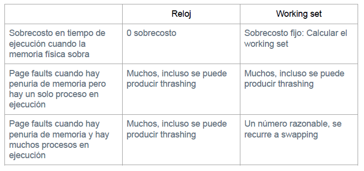

# Tablas de Paginamiento

**Problema:** El diagrama de mas abajo muestra la asignacion de paginas en un sistema Unix que ejecuta los procesos A y B. Las paginas son de 4KB. El nucleo utiliza la estrategia copy-on-write para implementar `fork`. En las tablas indique pagina virtual, pagina real y atributos de validez y escritura.

Las tablas de paginamiento son:

 

* Como la pagina virtual 6 para el proceso A se encuentra en disco, se marca su atributo de validez $V=0$, pues no esta cargada en memoria.
* Asi mismo las paginas de codigo para ambos procesos se marcan con su atributo de escritura $W=0$, pues son constantes y no necesitan cambiar.

**Problema:** Construya la tabla de paginas del proceso A despues de que este invoca `sbrk` pidiendo 10KB adicionales.

* Como pide 10KB adicionales y las paginas tienen un tamaño de 4KB, el sistema operativo le entrega 3 paginas, pues este redondea el tamaño pedido hacia arriba.

* Se buscan las paginas reales desocupadas para darselas al proceso A.

**Problema:** Considere que el proceso B invoco `fork`. Construya la tabla de paginas para el proceso hijo justo despues de que este modifico la pagina 11. No construya la tabla del padre.

* Al crear el proceso hijo se eliminan los permisos de escritura de las paginas virtuales del proceso B.

* Luego se realiza una copia de la pagina 11 para que esta sea utilizada por el hijo (lo hace el sistema operativo), cambiandole el permiso de escritura $W=1$. En este caso coincide con la pagina real 11, asi la tabla de paginas para el proceso hijo de B es:

# Estrategia del Reloj

La siguiente figura muestra los estados sucesivos de la memoria al realizar 2 accesos en un sistema de memoria virtual que usa la estrategia del reloj para el reemplazo de paginas.

Las paginas que tiene el bit de referencia en 1, aparecen encerradas en una circunferencia. La posicion del puntero esta señalada por la flecha. En la figura se observa una primera transicion de estados cuando se accesa la pagina 6 (residente) y una segunda transicion al accesar la pagina 5 (no residente). A continuacion se accesan las siguiente paginas de memoria: 4 7 5 3 4 1 5

**Problema:** Siguiendo el mismo esquema de la figura, muestre los estados de la memoria despues de realizar cada uno de los accesos indicadas.

Los estados de la memoria segun los accesos es:

# Estrategia del Working Set

El siguiente diagrama muestra con una `r` las lecturas en memoria y con una `w` las escrituras para un proceso que se ejecuta en un sistema Unix que utiliza la estrategia del working set. Las letras A, B, C, etc. denotan los intervalos para los que se calcula el working set. Los numeros 0, 1, 2, etc. denotan las paginas del proceso.

**Problema:** Suponga que al incicio de A todas las paginas el atributo Dirty en falso. Indique para los periodos C a F qué accesos pueden producir page-faults. Utilice coordenadas del estilo (G, 4, 1er acceso).

Los accesos que producen un page fault son:

* (C, 3, 1er acceso)
* (D, 5, 1er acceso)
* (E, 0, 1er acceso)
* (E, 3, 1er acceso)
* (F, 5, 1er acceso)

**Problema:** Indique el valor del atributo Referenced para todas las paginas al inicio del intervalo E y al final de ese intervalo.

* **Despues del calculo del working en un intervalo los bits R de las paginas virtuales se deben resetear a 0 para calcular el siguiente working set.**
* 

**Problema:** Suponga que al inicio de E el atributo Dirty de la pagina 5 es falso. Explique si el acceso (Dm 5, 1er acceso) produjo o no un page fault.

* Hubo un page fault. De no haber existido, el bit D (dirty) deberia ser verdadero, dado que hubo ua escritura en (A, 5, 2do acceso). Despues esa escritura, la pagina se llevo a disco, y fue cargada por el page fault de (D, 5, 1er acceso), estableciedo su bit D en 0.

**Problema:** Indique el valor del atributo Dirty para cada pagina al inicio del intervalo E y al final de ese intervalo, suponiendo que o hubo ningun page fault en el periodo A-E.

* Las paginas que poseen el bit D en verdadero supoiendo que no hubo ningun page fault, es decir, ninguna fue pedida desde el disco, son aquellas que poseen su bit $W=1$:

* Luego se suman las paginas que tienen el bit $W=1$ al final del proceso E:

**Problema:** Compare las dos estrategias de paginamiento en demanda vistas en el curso desde el punto de vista:

* Si la memoria sobre podemos tener todas las paginas que queramos en la memoria.

# Fallas en la TLB

En una aplicacion se requiere implementar un diccionario. Se consideran 2 implementaciones:

**Problema:** En la primera implementacion toda la informacion se encuentra contigua en memoria. En la segunda, las entradas del diccionario pueden quedar muy dispersas y desordenadas en la memoria debido a que el heap que maneja malloc esta fragmentado. Suponga que las busquedas en el diccionario son secuenciales. Estime para ambas implementaciones el peor caso del numero de fallas en la TLB al hacer una busqueda. ¿Cuantos accesos adicionales a la memoria significaria cada falla en la TLB considerando un microprocesador Intel x86? Considere paginas de 4KB.

* Caso `Entry dict[1000]`:La estructura ocupa $1000\cdot 32$ bytes = $32000$ bytes $\approx$ $8$ paginas contigua en memoria. En el peor casom la busqueda visita las 8 paginas, por lo que la TLB tendra a lo mas 8 desaciertos.
* Caso `Entry *dict[1000]`: Como los datos residen en un heap fragmentado, en el peor caso las 1000 entradas del diccionario se encuentran dispersas en 1000 paginas distintas. Por lo tanto, en el peor caso la busqueda visita 1000 paginas, por lo que la TLB tendra a lo mas 1000 desaciertos.

* En relacion a los accesos a memoria en un Interl x86, cada falla en la TLB incurre en 2 accesos adicionales a memoria: El primero para acceder al directorio de tablas y el segundo para leer la tabla de paginas.