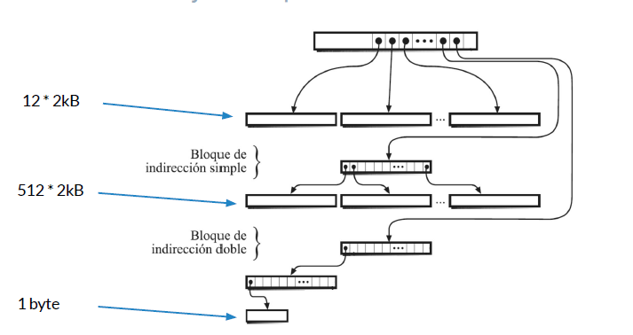

# Ejecucion de procesos

* **Proceso intensivo:** Requiere principalmente del poder del procesador para su ejecucion, sin usar mayormente ningun otro componente (Ej: Calcular series numericas).

* **Proceso intensivo en E/S:** Consiste principalmente en leer y escribir en un disco (Ej: Copiar una gran cantidad de archivos).

## Ejercicios

Suponga que en un instante dado necesita ejecutar 4 procesos independientes entre si en una maquina quad-core. Discuta si lanzaria los procesos simultaneamente, secuencialmente o en algun orden especifico considerando que:

* Todos los procesos son intensivos en CPU, pero no en E/S:

**R:** Una maquina quad-core tiene cuatro nucleos independientes, lo cual permitirá ejecutar hasta cuatro procesos intensivos en CPU en forma paralela sin interferir entre ellos.

* Todos los procesos son intensivos en E/S, pero no en CPU. Hay un solo disco:

**R:** Si tenemos procesos intensivos en E/S sobre un solo disco, al ejecuarlos en paralelo logrremos que el disco (y en particular el cabezal) sea un cuello de botella en la ejecucion. El tiempo de ejecucion podria ser mayor a que hayan sido lanzados secuencialmente (donde cada uno usaria el disco en forma exclusiva).

* 2 procesos son solo intensivos en E/S y los otros 2 procesos son solo intensivos en CPU. Hay un solo disco:

**R:** Si tenemos dos procesos intensivos en CPU (P1 y P2) y dos procesos intensivos en E/S sobre un solo disco (P3 y P4) podriamos lanzar en forma paralela P1, P2 y P3 y una vez finalizado P3 iniciar P4 a continuacion.

# Inodes y bloques de datos

Un **inodo** contiene:
* 12 punteros a bloques de datos.
* 1 puntero a un bloque de indireccion simple.
* 1 puntero de indireccion doble.
* 1 puntero de indireccion triple.

**OBS:** Dependiendo de la maquina la cantidad de bloques puede variar.

**Un bloque de indireccion simple es un bloque de datos que en vez de contener bytes del archivo, contiene punteros a otros bloques de datos que contendran bytes del archivo. Cada puntero a bloque de datos es de 32 bits (4 byte).**

## Ejercicios

En un sistema Unix un archivo tiene un tamaño de (12+256)*512+1 bytes.

* Explique cuantos bloques de datos y bloques de indireccion se utilizaran, suponiendo que el tamaño de los bloques de la particion es 512 bytes.

**R:** Si el tamaño del bloque es de 512 bytes, entonces cada bloque de indireccion podra contener hasta 128 punteros (4 bytes * 128), pues cada puntero a bloque de datos es de 32 bits (4 bytes).

Utiliando los 12 punteros de datos que hay en el inodo podremos referencia 12*512 bytes.

Con el puntero de indireccion simple podremos referenciar 128*512 bytes.

Con el puntero de indireccion doble podremos referenciar un maximo de 128 * 128 * 512 bytes, lo que es suficiente para contener los 128*512 + 1 bytes faltantes (deberemos ocupar y referenciar 129 bloques).


* Suponga que un programa usa `lseek` para posicionarse en el ultimo byte del archivo y lo lee. Explique cuantos bloques sera necesario leer. Suponga que el cache de disco esta complatemente vacio.

**R:** Debemos leer 4 bloques: el bloque del inodo, el bloque de indireccion doble en primer y segundo nivel y el bloque de datos.

En un sistema Unix un archivo tiene un tamaño de (12+256)*512+1 bytes.

* Explique cuantos bloques de datos y bloques de indireccion se utilizaran, suponiendo que el tamaño de los bloques de la particion es 4096 bytes.

**R:** Si el tamaño del bloque es de 4096 bytes, entonces cada bloque de indireccion podra contener hasta 1024 punteros (4bytes*1024).

Utilizando los 12 punteros de datos que hay en el inodo podremos referenciar 12*4096bytes = 48 kB.

Con el puntero de indireccion simple podremos referenciar 1024 * 4096 bytes = 4096 kB, lo que es suficiente para contener los 86 kB + 1 byte restantes (deberemos ocupar y referenciar 22 bloques de datos).


* Suponga que un programa usa `lseek` para posicionarse en el ultimo byte del archivo y lo lee. Explique cuantos bloques sera necesario leer. Suponga que el cache de disco esta completamente vacio.

**R:** Debemos leer 3 bloques: el bloque del inodo, el bloque de indireccion simple y el bloque de datos.

* Se tiene un archivo que no requiere bloques de indireccion doble de una particion Unix con bloques de 2kB. Se agrega un byte a este archivo y se crea el bloque de indireccion doble. Haga un diagrama mostrando inodo, bloques de datos y de indireccion. De que tamaño es el archivo?

**R:** Dado que el bloque de indireccion es de 2kB, contiene 512 punteros a bloques de datos (4 bytes * 512).

Por lo tanto el archivo es de 12 * 2kB + 512*2kB + 1 byte = 1048kB + 1.



# Archivos y directorios

* La figura muestra varios archivos y directorios de la particion `/u` en un sistema Unix:

  

* La usuaria ana ejecuta los siguientes comandos:
  ```
  % mkdir /u/ana/tmp
  % cd /u/ana
  % ln x tmp/z
  % cp y tmp/w
  % cd tmp
  % ln -s ../x v
  ```

* Rehaga la figura de acuerdo a los cambios realizados.


# Disco moderno vs SSD

Suponga que en un sistema existen solo 2 procesos en ejecucion. Ambos leen secuencialmente archivos de gran tamaño en la misma particion con bloques de 1kB.

El primero de los archivos se encuentra localizado en las pistas externas del disco, mientras que el segundo en las pistas internas.

Ambos procesos leen los archivos en trozos de 1kB usando `read`. Estime la velocidad de lectura de estos archivos considerando los siguientes tipos de almacenamiento secundario:

* Un disco moderno con tiempo de acceso y velocidad de transferencia razonables, el nucleo no implementa read-ahead

**R:** Supongo disco de 10 milisegundos de tiempo de acceso y tasa de transferencia de 100 MB/seg. Cada bloque requiere desplazar el cabezal del disco y por lo tanto cuesta 10 milisegundos. El tiempo de transferencia es marginal. La velocidad total de lectura es de 100 kB/seg. Para cada archivo es de 50 kB/seg. (Se pueden considerar razonables tiempos de acceso entre 3 a 30 milisegundos y tasas de transferencia entre 10 y 200 MB/seg)

* El mismo disco moderno, el nucleo implementa read-ahead de 100 bloques:

**R:** Cada lectura lee 100 KB y requiere 10 milisegundos para desplazar el cabezal y 0.1 milisegundos de tiempo de transferencia (marginal). La velocidad total de lectura es de 10 MB/seg o 5 MB/seg para cada archivo.

* Un SSD, el nucleo no implementa read-ahead:

**R:** Considero una tasa de transferencia de 200 MB para el SSD. Como no hay que mover el cabezal, en teoria la velocidad total de lectura es de 200 MB/seg. (En la practica se alcanzan velocidades de unos 40 MB/seg. Tasas de transferencia razonables para un SSD son de 50 a 2000 MB/seg)